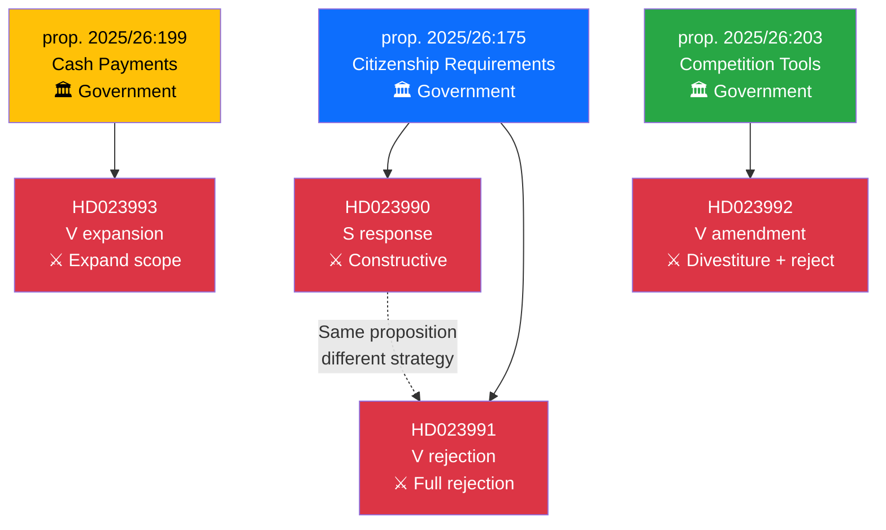

# Cross-Reference Map — 2026-03-27

## 📋 Cross-Reference Context

| Field | Value |
|-------|-------|
| **Map ID** | `XREF-2026-03-27-MOT` |
| **Analysis Date** | `2026-03-30 06:41 UTC` |
| **Documents Mapped** | 4 |
| **Cross-References Found** | 3 |
| **Produced By** | `news-motions` |

---

## 📊 Document Relationship Map

## Cross-Reference Table

| Source | Target | Relationship | Notes |
|--------|--------|-------------|-------|
| HD023990 (S) | HD023991 (V) | Same proposition response | Both respond to prop. 2025/26:175 but with opposite strategies |
| HD023990 | prop. 2025/26:175 | Motion responding to proposition | S constructive modification |
| HD023991 | prop. 2025/26:175 | Motion responding to proposition | V comprehensive rejection |
| HD023993 | prop. 2025/26:199 | Motion responding to proposition | V expands cash mandate scope |
| HD023992 | prop. 2025/26:203 | Motion responding to proposition | V adds divestiture power, rejects public sector rules |

## Document Control

| Field | Value |
|-------|-------|
| **Classification** | PUBLIC |
| **Retention** | 12 months |
