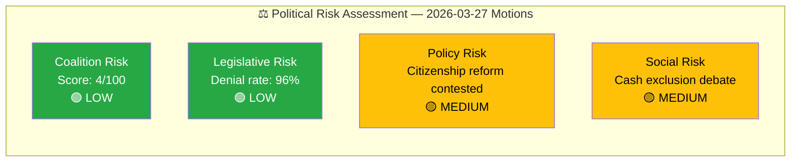

# Political Risk Assessment — 2026-03-27

## �� Risk Context

| Field | Value |
|-------|-------|
| **Risk ID** | `RSK-2026-03-27-MOT` |
| **Analysis Date** | `2026-03-30 06:41 UTC` |
| **Documents Analyzed** | 4 |
| **Produced By** | `news-motions` |
| **Overall Risk Level** | **LOW** |
| **Confidence** | **HIGH** |

---

## 📊 Risk Dashboard

## 5×5 Risk Matrix

| Likelihood ↓ / Impact → | Negligible (1) | Minor (2) | Moderate (3) | Significant (4) | Severe (5) |
|--------------------------|:-:|:-:|:-:|:-:|:-:|
| **Almost Certain (5)** | | | | | |
| **Likely (4)** | | | | | |
| **Possible (3)** | | | PR-1: Citizenship S-V split | | |
| **Unlikely (2)** | | | SR-1: Cash exclusion gains traction | | |
| **Rare (1)** | CR-1: Coalition instability | | | | |

## Risk Register

| Risk ID | Description | Likelihood | Impact | Score | Evidence (dok_id) | Confidence |
|---------|------------|:----------:|:------:|:-----:|-------------------|:----------:|
| CR-1 | Coalition destabilization from opposition motions | 1 | 1 | 1 | All 4 motions from V/S only | `H` |
| PR-1 | S-V divergence on citizenship creates media narrative of split opposition | 3 | 3 | 9 | HD023990, HD023991 | `M` |
| SR-1 | Cash exclusion debate gains public support, pressuring FiU | 2 | 3 | 6 | HD023993 | `M` |
| LR-1 | Competition tool amendments gain traction in NU committee | 2 | 2 | 4 | HD023992 | `L` |

## Anomaly Flags

| Severity | Type | Description | Evidence |
|----------|------|-------------|----------|
| 🟡 MEDIUM | CROSS_PARTY | Both S and V oppose same government proposition (175) but with incompatible strategies | HD023990, HD023991 |
| 🟢 LOW | VOLUME | V filed 3 motions on single day — above average for single-party daily output | HD023991, HD023992, HD023993 |

## Implications

- **Coalition stability**: No risk. All opposition from outside the governing coalition.
- **Legislative outcome**: All 4 motions likely to be denied given 96% historical denial rate.
- **Monitoring priority**: SfU committee handling of citizenship motions — potential for public debate.

## Document Control

| Field | Value |
|-------|-------|
| **Classification** | PUBLIC |
| **Retention** | 12 months |
