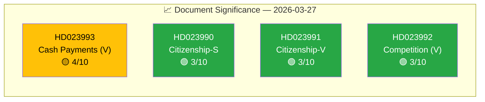

# Significance Scoring — 2026-03-27

## 📋 Scoring Context

| Field | Value |
|-------|-------|
| **Scoring ID** | `SIG-2026-03-27-MOT` |
| **Analysis Date** | `2026-03-30 06:41 UTC` |
| **Documents Scored** | 4 |
| **Produced By** | `news-motions` |
| **Average Score** | **3.5/10** |
| **Confidence** | **MEDIUM** |

---

## 📊 Significance Dashboard

## Scoring Table

| Rank | dok_id | Title | Party | Committee | Score | Urgency | Domain |
|:----:|--------|-------|-------|-----------|:-----:|:-------:|--------|
| 1 | HD023993 | Cash payment functionality (6 proposals) | V | FiU | 🟡 4/10 | ⚪ ROUTINE | Fiscal policy |
| 2 | HD023990 | Citizenship requirements (S constructive) | S | SfU | 🟢 3/10 | ⚪ ROUTINE | Migration |
| 3 | HD023991 | Citizenship requirements (V rejection) | V | SfU | 🟢 3/10 | ⚪ ROUTINE | Migration |
| 4 | HD023992 | Competition tools (divestiture powers) | V | NU | 🟢 3/10 | ⚪ ROUTINE | Trade & industry |

## Scoring Methodology

Significance scores based on: (1) legislative impact probability, (2) public interest level, (3) coalition stability effect, (4) cross-party dynamics, (5) media attention potential.

## Document Control

| Field | Value |
|-------|-------|
| **Classification** | PUBLIC |
| **Retention** | 12 months |
