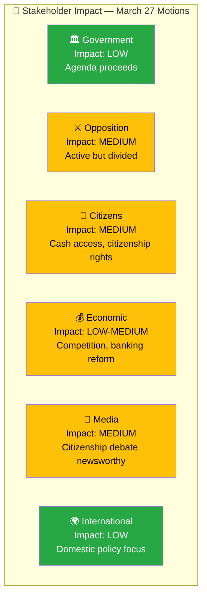

# Stakeholder Perspective Analysis — 2026-03-27

## 📋 Analysis Context

| Field | Value |
|-------|-------|
| **Analysis ID** | `STK-2026-03-27-MOT` |
| **Analysis Date** | `2026-03-30 06:41 UTC` |
| **Documents Analyzed** | 4 |
| **Produced By** | `news-motions` |
| **Stakeholder Lenses** | 6 |
| **Confidence** | **MEDIUM** |

---

## 📊 Six-Lens Stakeholder Impact Matrix

## Detailed Stakeholder Analysis

| Stakeholder | Impact | Sentiment | Key Concern | Evidence (dok_id) | Confidence |
|-------------|:------:|:---------:|-------------|-------------------|:----------:|
| 🏛️ Government | LOW | Neutral | Motions unlikely to alter agenda; 96% denial rate | All 4 | `H` |
| ⚔️ V (Left Party) | HIGH | Negative | Broad rejection strategy across 3 policy domains; seeks fundamental policy shifts | HD023991, HD023992, HD023993 | `H` |
| ⚔️ S (Social Democrats) | MEDIUM | Mixed | Constructive engagement on citizenship — accepts reform principle, seeks modifications | HD023990 | `H` |
| 👤 Stateless children/immigrants | HIGH | Negative | V demands protection of notification procedure; S demands Children's Convention compliance | HD023990, HD023991 | `M` |
| 👤 Cash-dependent populations | MEDIUM | Positive | V proposes expanded mandatory cash acceptance covering daily services | HD023993 | `M` |
| �� Banking sector | LOW-MEDIUM | Negative | V proposes mandatory cash infrastructure sharing; cites banking oligopoly | HD023992, HD023993 | `M` |
| 💰 Retail sector | LOW | Mixed | Cash mandate expansion affects cafes, restaurants, clothing stores | HD023993 | `M` |
| 📰 Media | MEDIUM | Neutral | Citizenship reform generates debate; cash exclusion human interest angle | HD023990, HD023991 | `M` |
| 🌍 EU/International | LOW | Neutral | Domestic policy focus; no EU dimension | All | `L` |

## Document Control

| Field | Value |
|-------|-------|
| **Classification** | PUBLIC |
| **Retention** | 12 months |
