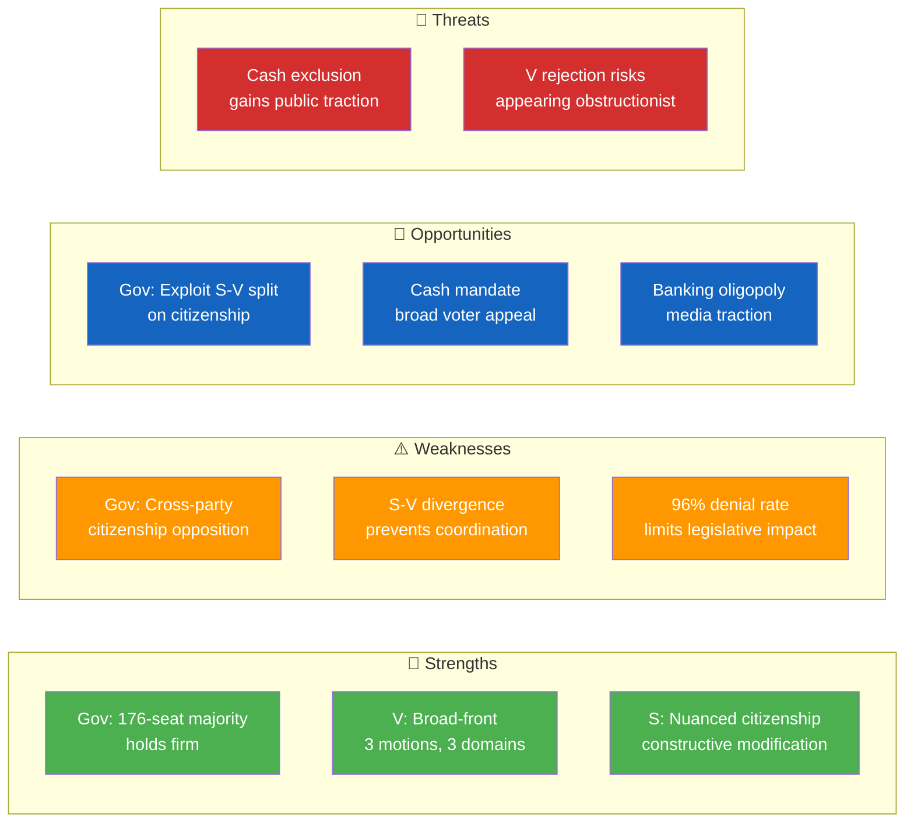

# Political SWOT Analysis — 2026-03-27

## 📋 SWOT Context

| Field | Value |
|-------|-------|
| **SWOT ID** | `SWT-2026-03-27-MOT` |
| **Analysis Date** | `2026-03-30 06:41 UTC` |
| **Analysis Scope** | Government coalition vs Opposition on March 27 motions |
| **Reference Period** | 2026-Q1 |
| **Produced By** | `news-motions` |
| **Primary MCP Sources** | `get_motioner`, `get_dokument` |
| **Validity Window** | Entries valid until 2026-04-27 |

---

## 🏛️ Section 1: Government Coalition SWOT

### ✅ Strengths — Government Coalition

| # | Strength Statement | Evidence (dok_id) | Confidence | Impact | Entry Date |
|---|-------------------|-------------------|:----------:|:------:|:----------:|
| S1 | Coalition maintains 176-seat working majority through SD support agreement; all 4 opposition motions filed by V and S, no defections from coalition parties | HD023990, HD023991 | `H` | `H` | 2026-03-27 |
| S2 | 96% motion denial rate demonstrates government's ability to advance legislative agenda despite active opposition | HD023993, HD023992 | `H` | `M` | 2026-03-27 |

### ⚠️ Weaknesses — Government Coalition

| # | Weakness Statement | Evidence (dok_id) | Confidence | Impact | Entry Date |
|---|-------------------|-------------------|:----------:|:------:|:----------:|
| W1 | Citizenship reform generates both S and V opposition — cross-party alignment on migration critique risks broadening public discourse against government approach | HD023990, HD023991 | `M` | `M` | 2026-03-27 |

### 🌟 Opportunities — Government Coalition

| # | Opportunity Statement | Evidence (dok_id) | Confidence | Impact | Entry Date |
|---|----------------------|-------------------|:----------:|:------:|:----------:|
| O1 | S–V divergence on citizenship reform (S accepts, V rejects) prevents unified opposition — government can frame S as constructive partner | HD023990, HD023991 | `M` | `H` | 2026-03-27 |
| O2 | Competition law reform (prop. 2025/26:203) strengthens market oversight narrative — only V opposes specific provisions | HD023992 | `M` | `M` | 2026-03-27 |

### 🔴 Threats — Government Coalition

| # | Threat Statement | Evidence (dok_id) | Confidence | Impact | Entry Date |
|---|-----------------|-------------------|:----------:|:------:|:----------:|
| T1 | Cash payment debate could gain public traction as digitalization exclusion affects elderly/rural populations — V's expanded cash mandate resonates with broad voter base | HD023993 | `M` | `M` | 2026-03-27 |

---

## 🏛️ Section 2: Opposition SWOT

### ✅ Strengths — Opposition

| # | Strength Statement | Evidence (dok_id) | Confidence | Impact | Entry Date |
|---|-------------------|-------------------|:----------:|:------:|:----------:|
| S1 | V demonstrates broad-front opposition capacity: 3 motions across fiscal, migration, and competition policy on a single day | HD023991, HD023992, HD023993 | `H` | `M` | 2026-03-27 |
| S2 | S shows nuanced policy capacity — accepting citizenship reform principle while demanding targeted modifications (Children's Convention, income calculation, age thresholds) | HD023990 | `H` | `M` | 2026-03-27 |

### ⚠️ Weaknesses — Opposition

| # | Weakness Statement | Evidence (dok_id) | Confidence | Impact | Entry Date |
|---|-------------------|-------------------|:----------:|:------:|:----------:|
| W1 | S–V strategic divergence on citizenship: S's constructive engagement vs V's full rejection prevents coordinated opposition pressure | HD023990, HD023991 | `H` | `H` | 2026-03-27 |
| W2 | 96% motion denial rate means legislative impact of all filed motions is minimal — opposition activity is primarily symbolic | All 4 motions | `H` | `H` | 2026-03-27 |

### 🌟 Opportunities — Opposition

| # | Opportunity Statement | Evidence (dok_id) | Confidence | Impact | Entry Date |
|---|----------------------|-------------------|:----------:|:------:|:----------:|
| O1 | Cash payment expansion (HD023993) could build cross-party support — digital exclusion concerns resonate beyond V's base with C and S voters | HD023993 | `M` | `M` | 2026-03-27 |
| O2 | Competition policy critique highlighting banking oligopoly and ICA's ~50% grocery market share may gain media traction | HD023992 | `M` | `M` | 2026-03-27 |

### 🔴 Threats — Opposition

| # | Threat Statement | Evidence (dok_id) | Confidence | Impact | Entry Date |
|---|-----------------|-------------------|:----------:|:------:|:----------:|
| T1 | V's blanket rejection approach on citizenship risks appearing obstructionist to swing voters who support moderate reform | HD023991 | `M` | `M` | 2026-03-27 |

---

## 📊 SWOT Quadrant Mapping

## Strategic Implications

### Key Watch Items

| # | Watch Item | Trigger | Timeline | Owner |
|---|-----------|---------|----------|-------|
| 1 | SfU committee handling of citizenship motions (HD023990, HD023991) | Committee schedule announcement | 2-4 weeks | SfU |
| 2 | FiU response to cash payment expansion proposals | Committee deliberation | 2-4 weeks | FiU |
| 3 | NU handling of competition tool amendments | Committee report | 2-4 weeks | NU |
| 4 | Media coverage of cash exclusion debate | Public opinion shift | 1-3 weeks | Media |

## Document Control

| Field | Value |
|-------|-------|
| **Classification** | PUBLIC |
| **Retention** | 12 months |
| **Next Review** | 2026-04-03 |
