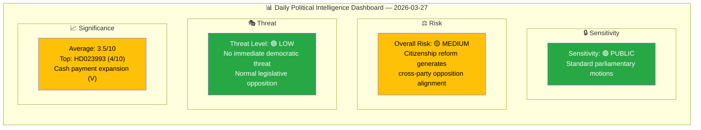

# Analysis Synthesis Summary — 2026-03-27

## 📋 Synthesis Context

| Field | Value |
|-------|-------|
| **Synthesis ID** | `SYN-2026-03-27-MOT` |
| **Analysis Date** | `2026-03-30 06:41 UTC` |
| **Documents Analyzed** | 4 |
| **Analysis Period** | `2026-03-27 00:00–23:59 UTC` |
| **Produced By** | `news-motions` |
| **Overall Confidence** | **MEDIUM** |

---

## 📊 Intelligence Dashboard

## 📋 Document Summary Table

| # | dok_id | Title | Party | Committee | Significance | Domain |
|---|--------|-------|-------|-----------|:------------:|--------|
| 1 | HD023993 | Measures to strengthen cash functionality | V | FiU | 🟡 4/10 | Fiscal policy |
| 2 | HD023990 | Stricter citizenship requirements (S response) | S | SfU | 🟢 3/10 | Migration policy |
| 3 | HD023991 | Stricter citizenship requirements (V rejection) | V | SfU | 🟢 3/10 | Migration policy |
| 4 | HD023992 | New competition tools for markets | V | NU | 🟢 3/10 | Trade & industry |

## Key Findings

1. **Left Party (V) dominates opposition activity** with 3 of 4 motions, covering fiscal, migration, and competition policy — signalling broad-front opposition strategy. **[HIGH]**
2. **Citizenship reform (prop. 2025/26:175) generates cross-party opposition** — both S and V filed motions, but with divergent strategies: S accepts core reform but seeks modifications; V demands full rejection. **[HIGH]**
3. **HD023993 (cash payments)** is highest significance (4/10) — V proposes expanding mandatory cash acceptance to cafes, restaurants, fuel stations, public transit, and leisure activities. Referred to FiU. **[MEDIUM]**
4. **HD023992 (competition)** challenges government's competition law overhaul — V wants Konkurrensverket empowered to force asset divestiture while rejecting new rules on public sector commercial activities. **[MEDIUM]**
5. **Coalition risk: LOW** — all motions are from opposition parties (V, S), and the 96% motion denial rate means legislative impact is minimal. Government agenda proceeds largely unimpeded. **[HIGH]**

## Thematic Analysis

### Theme 1: Migration & Citizenship Reform (3 documents)

The government's prop. 2025/26:175 on stricter citizenship requirements triggered the most opposition activity. Key fault line: **S (constructive modification) vs V (total rejection)**.

- **S approach** (HD023990, Ida Karkiainen): Accepts principle of strengthened citizenship but demands: (1) Children's Convention compliance in removing notification procedure, (2) include unemployment benefits in income calculations, (3) set 18 as knowledge requirement threshold, (4) modified implementation timeline.
- **V approach** (HD023991, Tony Haddou): Comprehensive rejection — demands riksdag reject all key provisions including identity requirements for children, extended residency requirements, and "honorable conduct" criteria.

### Theme 2: Financial Consumer Protection (1 document)

HD023993 (Ida Gabrielsson, V): Proposes 6 riksdag decisions expanding cash acceptance obligations, including mandatory cash acceptance at public-facing businesses, credit institution infrastructure sharing, and expanded Riksbanken responsibility.

### Theme 3: Market Competition (1 document)

HD023992 (Birger Lahti, V): Challenges government competition law reform (prop. 2025/26:203) by demanding stronger divestiture powers for Konkurrensverket and rejecting new rules targeting public sector commercial activities. Cites oligopoly concerns in banking and grocery markets (ICA ~50% market share).

## Implications

- **Coalition stability**: No threat. Opposition motions follow normal legislative process.
- **Government agenda**: Citizenship reform, cash regulation, and competition tools all proceeding through committee stage.
- **Opposition dynamics**: V positions itself as the most active opposition party, filing on multiple policy fronts simultaneously.
- **S–V divergence on citizenship**: S's constructive engagement vs V's rejection may foreshadow different opposition strategies approaching 2026 election.

## Data Quality Notes

Overall confidence: **MEDIUM**. Full-text content available for all 4 motions. Analysis based on motion proposals and rationale text. Committee deliberations not yet available.
