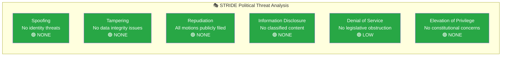

# Political Threat Analysis — 2026-03-27

## 📋 Threat Context

| Field | Value |
|-------|-------|
| **Threat ID** | `THR-2026-03-27-MOT` |
| **Analysis Date** | `2026-03-30 06:41 UTC` |
| **Documents Analyzed** | 4 |
| **Produced By** | `news-motions` |
| **Overall Threat Level** | **LOW** |
| **Confidence** | **HIGH** |

---

## 📊 Threat Landscape

## Threat Register

| Threat ID | STRIDE Category | Description | Severity | Evidence (dok_id) | Confidence |
|-----------|----------------|-------------|:--------:|-------------------|:----------:|
| THR-001 | Denial of Service | V's blanket rejection strategy (8 proposals in HD023991 alone) could slow SfU committee proceedings | 🟢 LOW | HD023991 | `M` |
| THR-002 | Information Disclosure | No sensitive content — all motions are standard PUBLIC parliamentary documents | 🟢 NONE | All | `H` |

## Democratic Health Assessment

| Indicator | Status | Evidence |
|-----------|--------|----------|
| Opposition access to parliamentary process | ✅ Healthy | V and S freely filing motions |
| Government accountability mechanisms | ✅ Functioning | Committee referrals active (SfU, FiU, NU) |
| Media transparency | ✅ Adequate | All documents publicly accessible |
| Cross-party democratic discourse | ⚠️ Partial | S-V divergence may limit unified accountability pressure |

## Document Control

| Field | Value |
|-------|-------|
| **Classification** | PUBLIC |
| **Retention** | 12 months |
