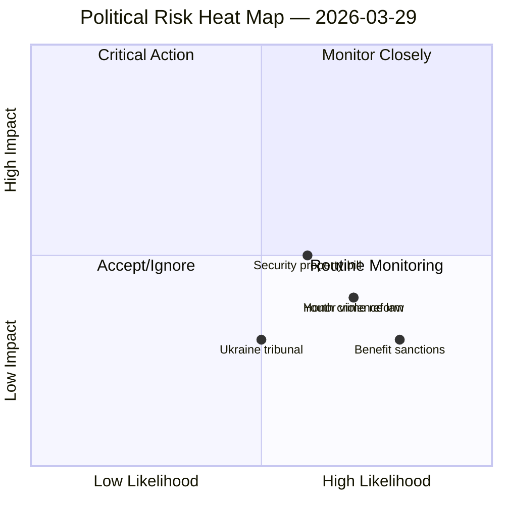

# Risk Assessment — 2026-03-29

**ID**: RSK-20260329
**Generated**: 2026-03-29 23:00 UTC
**Riksmöte**: 2025/26
**Confidence**: MEDIUM

## Risk Matrix (Likelihood × Impact)

## Identified Risks

### RSK-001: Security Protection Real Estate (JuU29)
- **Likelihood**: 3/5 (bill already in committee, likely to pass)
- **Impact**: 3/5 (strengthens national security framework)
- **L×I Score**: 9/25
- **Category**: Defense/Security
- **Mitigation**: Legislation provides new tools against hostile state property acquisition

### RSK-002: Youth Crime Investigation Reform (Prop 2025/26:227)
- **Likelihood**: 4/5 (government priority, broad support expected)
- **Impact**: 2/5 (procedural reform, not structural change)
- **L×I Score**: 8/25
- **Category**: Criminal Justice
- **Mitigation**: Standard legislative process

### RSK-003: Honor Violence Legislation (Prop 2025/26:213)
- **Likelihood**: 4/5 (cross-party support expected)
- **Impact**: 2/5 (strengthens existing framework)
- **L×I Score**: 8/25
- **Category**: Criminal Justice/Social Policy

## Overall Risk Level

**LOW** — No critical risks identified. Most legislation follows expected government agenda. No coalition instability indicators.
