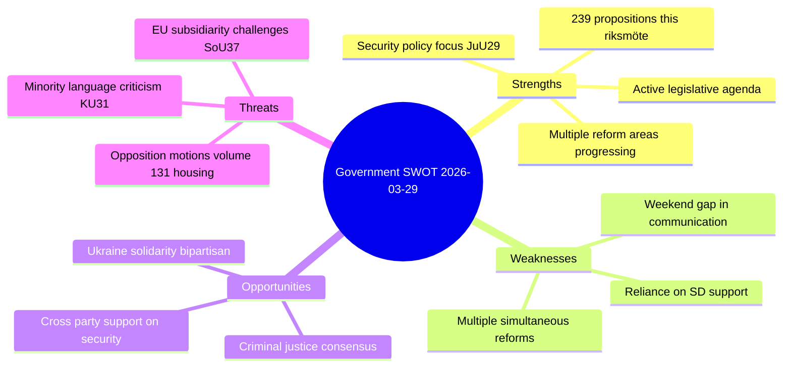

# SWOT Analysis — 2026-03-29

**ID**: SWT-20260329
**Generated**: 2026-03-29 23:00 UTC
**Riksmöte**: 2025/26
**Confidence**: MEDIUM

## Government Coalition (M, KD, L + SD support)

## Strengths
- **Active legislative pace**: 239 propositions in 2025/26, with major bills on security (JuU29), criminal justice (Prop 227), and social policy (Prop 210, 213) advancing
- **Security policy leadership**: JuU29 on property security protection shows proactive defense posture against hostile state acquisition
- **Evidence**: dok_id HD03227 (youth crime), HD03213 (honor violence) demonstrate government priority areas progressing

## Weaknesses
- **Weekend communication gap**: No government publications on March 28-29
- **Volume of rejected motions**: Committee reports from March 26-27 reject hundreds of opposition motions (CU18: 131 housing motions, JuU11: 122 criminal law motions)

## Opportunities
- **Bipartisan security consensus**: JuU29 (security real estate) expected to gain broad support
- **Ukraine international law**: UU20/UU21 (aggression tribunal, compensation commission) show Sweden's international engagement

## Threats
- **EU subsidiarity tension**: SoU37 challenges EU directive on organ/GMO regulation — sovereignty conflict
- **Minority language criticism**: KU31 notes Riksrevisionen found state efforts insufficient for minority languages
