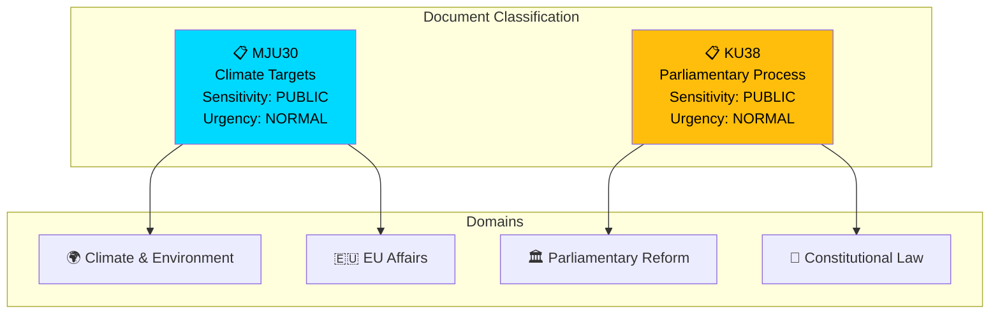

# Political Classification Results — 2026-03-30

**Generated**: 2026-03-31 04:53 UTC
**Analysis ID**: CLASS-2026-03-30-CR
**Data Sources**: get_betankanden
**Documents Analyzed**: 2
**Riksmöte**: 2025/26
**Confidence**: MEDIUM

---

## Summary

Classified **2** committee reports (betänkanden) by sensitivity, impact, urgency, and domain.

## Classification Overview

## Detailed Classification

### HD01MJU30 — Sveriges klimatmål
- **Type**: Betänkande (Committee Report)
- **Committee**: MJU (Environment & Agriculture)
- **Significance**: 🟡 Medium (5/10)
- **Sensitivity**: PUBLIC
- **Urgency**: NORMAL — pre-debate status
- **Domains**: Environmental and climate policy, EU regulatory alignment, energy transition
- **Confidence**: MEDIUM (60%)

### HD01KU38 — Den parlamentariska processen med ledamoten i fokus
- **Type**: Betänkande (Committee Report)
- **Committee**: KU (Constitutional)
- **Significance**: 🟡 Medium (5/10)
- **Sensitivity**: PUBLIC
- **Urgency**: NORMAL — pre-debate status
- **Domains**: Parliamentary reform, constitutional governance, democratic accountability
- **Confidence**: MEDIUM (60%)

## Data Quality Notes

Classification confidence: MEDIUM. Higher confidence when full-text content is available.
