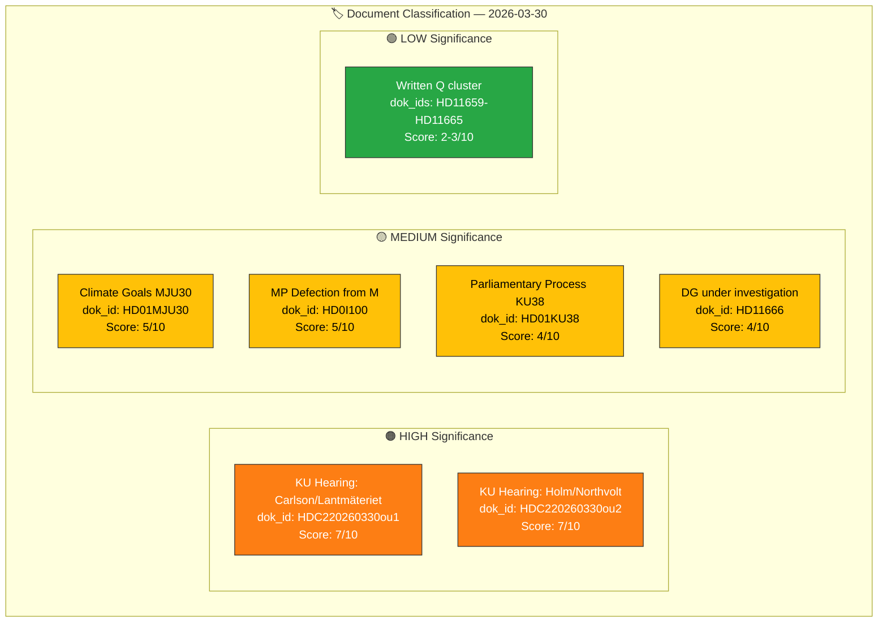

# 🏷️ Political Classification Results — 2026-03-30

**📋 Document Owner:** CEO | **📄 Version:** 1.0 | **📅 Last Updated:** 2026-03-30 (UTC)
**🏢 Owner:** Hack23 AB (Org.nr 5595347807) | **🏷️ Classification:** Public

---

## 📋 Classification Context

| Field | Value |
|-------|-------|
| **Classification ID** | `CLS-2026-03-30-001` |
| **Classification Date** | `2026-03-30 10:33 UTC` |
| **Documents Classified** | 12 |
| **Produced By** | `news-realtime-monitor` |
| **Taxonomy Version** | Political Classification Guide v1.0 |

---

## 📊 Classification Dashboard

### Detailed Classification Table

| dok_id | Title | Type | Sensitivity | Significance | Domains | Confidence |
|--------|-------|------|:-----------:|:------------:|---------|:----------:|
| HDC220260330ou1 | KU hearing: Minister Carlson on Lantmäteriet | sam-ou (hearing) | 🟡 SENSITIVE | 🟠 7/10 | National security, ministerial accountability, infrastructure | `[HIGH]` |
| HDC220260330ou2 | KU hearing: Ulf Holm on Northvolt/AP funds | sam-ou (hearing) | 🟡 SENSITIVE | 🟠 7/10 | Fiscal policy, state investment governance, financial markets | `[HIGH]` |
| HD01MJU30 | Climate goals — EU-adapted 2030 targets | bet (committee report) | 🟢 PUBLIC | 🟡 5/10 | Environmental policy, EU alignment, climate | `[MEDIUM]` |
| HD01KU38 | Parliamentary process reform | bet (committee report) | 🟢 PUBLIC | 🟡 4/10 | Constitutional reform, parliamentary procedure | `[MEDIUM]` |
| HD0I100 | Chamber agenda (includes M defection notice) | f-lista (agenda) | 🟢 PUBLIC | 🟡 5/10 | Party politics, coalition stability | `[HIGH]` |
| HD11666 | Director-generals under criminal investigation | fr (written question) | 🟢 PUBLIC | 🟡 4/10 | Justice policy, government agency accountability | `[MEDIUM]` |
| HD11664 | Child abuse detection online — EU expiry | fr (written question) | 🟢 PUBLIC | 🟡 4/10 | Child protection, EU law, digital policy | `[MEDIUM]` |
| HD11661 | LKAB workplace safety violations | fr (written question) | 🟢 PUBLIC | 🟢 3/10 | Labour policy, state enterprise accountability | `[MEDIUM]` |
| HD11662 | Ban on goods from occupied Palestine | fr (written question) | 🟢 PUBLIC | 🟢 3/10 | Foreign policy, trade sanctions | `[MEDIUM]` |
| HD11663 | Stateless Palestinians from Iraq | fr (written question) | 🟢 PUBLIC | 🟢 3/10 | Migration policy, enforcement | `[MEDIUM]` |
| HD11665 | Loot boxes in gaming | fr (written question) | 🟢 PUBLIC | 🟢 2/10 | Consumer protection, digital regulation | `[MEDIUM]` |
| HD11659 | Block rental proposal | fr (written question) | 🟢 PUBLIC | 🟢 2/10 | Housing policy | `[MEDIUM]` |

---

## 📋 Document Control

| Field | Value |
|-------|-------|
| **Classification** | Public |
| **Retention** | 90 days |
