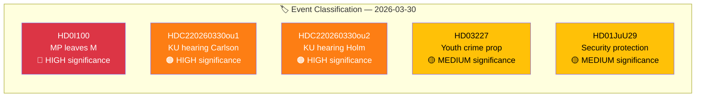

# 🏷️ Political Classification Results — 2026-03-30

## 📋 Classification Context

| Field | Value |
|-------|-------|
| **Classification ID** | `CLS-2026-03-30-001` |
| **Assessment Date** | `2026-03-30 01:14 UTC` |
| **Produced By** | news-realtime-monitor |
| **Sensitivity** | **PUBLIC** |

---

## 📊 Event Classification

| dok_id | Title | Domain | Sensitivity | Significance | Action |
|--------|-------|--------|:-----------:|:------------:|--------|
| HD0I100 | MP Lund Kopparklint leaves M party group | GOV/Coalition | PUBLIC | 8.5/10 | Breaking article |
| HDC220260330ou1 | KU hearing: Minister Carlson on Lantmäteriet | SEC/GOV | PUBLIC | 7.0/10 | Breaking article |
| HDC220260330ou2 | KU hearing: Ulf Holm on Northvolt/AP funds | FIN/GOV | PUBLIC | 7.0/10 | Breaking article |
| HD03227 | Prop 227: Youth crime investigation | JUS/CRI | PUBLIC | 6.0/10 | Context |
| HD01JuU29 | JuU29: Security protection for real estate | SEC/DEF | PUBLIC | 6.5/10 | Context |

---

**Document Control:**
- **Classification:** Public
