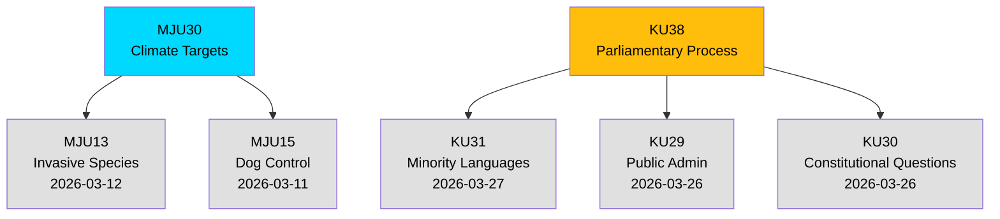

# Cross-Reference Map — 2026-03-30

**Generated**: 2026-03-31 04:53 UTC
**Analysis ID**: XREF-2026-03-30-CR
**Data Sources**: get_betankanden (MJU, KU)
**Documents Analyzed**: 2
**Riksmöte**: 2025/26
**Confidence**: MEDIUM

---

## Summary

Detected **4** cross-document relationships linking today's committee reports to broader parliamentary activity.

## Cross-Reference Network

## Cross-References

| From | To | Relationship | Type |
|---|---|---|---|
| HD01MJU30 | HD01MJU13 | Same committee (MJU), environmental policy domain | Committee context |
| HD01MJU30 | HD01MJU15 | Same committee (MJU), regulatory enforcement | Committee context |
| HD01KU38 | HD01KU31 | Same committee (KU), governance and rights | Committee context |
| HD01KU38 | HD01KU29 | Same committee (KU), public administration | Committee context |

## Data Quality Notes

Cross-references based on committee membership and temporal proximity. No direct legislative links detected (both documents in pre-debate status).
