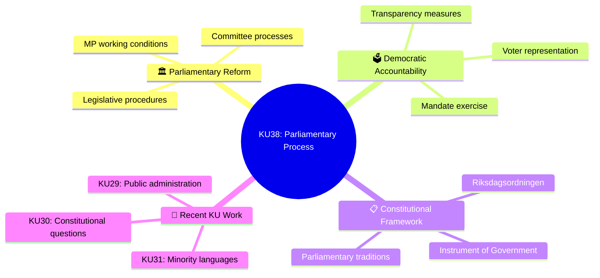
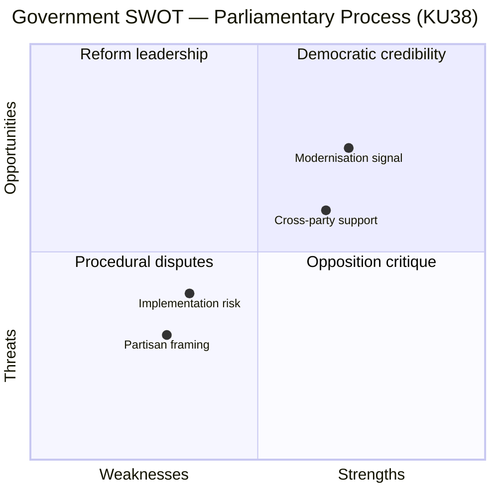
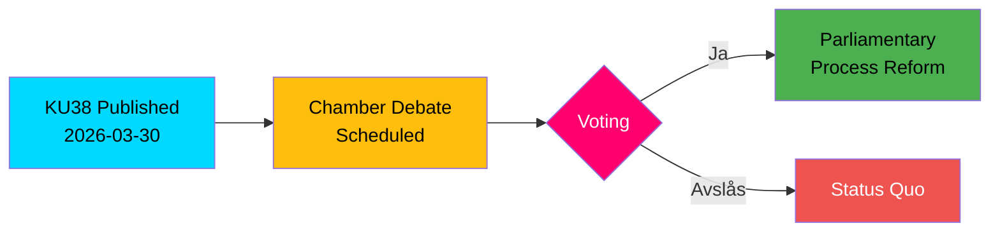

# Document Analysis: Den parlamentariska processen med ledamoten i fokus

**Generated**: 2026-03-31 04:52 UTC
**dok_id**: HD01KU38
**Document Type**: Betänkande (Committee Report)
**Committee**: KU (Konstitutionsutskottet)
**Date**: 2026-03-30
**Riksmöte**: 2025/26
**Significance**: 🟡 Medium (5/10)
**Confidence**: MEDIUM (60%)

---

## Executive Summary

The Constitutional Committee (KU) presents its report on the parliamentary process with focus on the individual MP ("ledamoten"). This report addresses the procedural framework governing how members of the Riksdag participate in legislative work, potentially covering areas such as MP rights, working conditions, transparency, and democratic accountability mechanisms. KU38 represents an introspective examination of parliamentary democracy itself — a meta-legislative act that could reshape how Sweden's 349 MPs perform their democratic mandate.

## Policy Domain Analysis

## Evidence Table

| Evidence Point | Source | Detail |
|---|---|---|
| Committee report published | dok_id: HD01KU38 | KU betänkande 2025/26:KU38, published 2026-03-30 |
| Status: Planned for debate | Riksdag API | Document status "planerat" — chamber debate scheduled |
| Related: Minority languages | dok_id: HD01KU31 | KU examined state promotion of national minority languages (2026-03-27) |
| Related: Public administration | dok_id: HD01KU29 | KU rejected 53 motions on public administration (2026-03-26) |
| Related: Constitutional questions | dok_id: HD01KU30 | KU rejected 83 motions on constitutional issues (2026-03-26) |
| Related: County administration | dok_id: HD01KU37 | KU examined concentration of county administration (2026-03-12) |
| Related: Digital meetings | dok_id: HD01KU35 | KU examined digital municipal meetings and oversight (2026-03-12) |
| Coalition stability | CIA metrics | Coalition stability score: 83/100 |
| Motion denial rate | CIA metrics | 96% opposition motion denial rate |

## SWOT Analysis

### Government Perspective

#### Strengths 💪
- **Democratic modernisation**: Examining the parliamentary process demonstrates commitment to improving democratic governance from within (dok_id: HD01KU38)
- **Prolific KU session**: The Constitutional Committee has been exceptionally active this session with 7+ reports covering constitutional questions, public administration, minority languages, digital governance, and county reform (dok_ids: HD01KU31, KU29, KU30, KU35, KU36, KU37)

#### Weaknesses ⚠️
- **Broad framing risk**: Title "Den parlamentariska processen med ledamoten i fokus" is deliberately broad — specifics unclear without full text
- **Process vs. substance**: Parliamentary procedure reforms risk being perceived as procedural rather than impactful

#### Opportunities 🌟
- **Cross-party consensus**: Parliamentary process improvements typically attract broader support than policy-specific legislation
- **Democratic health signalling**: Report demonstrates the Riksdag's capacity for self-examination and institutional improvement

#### Threats 🔴
- **High motion denial rate context (96%)**: Any discussion of MP influence in the parliamentary process occurs against a backdrop where opposition motions face near-universal rejection — this tension could surface in debate (CIA metrics, rm 2025/26)
- **Partisan instrumentalisation**: Risk that debate becomes proxy for government-opposition power dynamics

### Opposition Perspective

#### Strengths 💪
- **Accountability platform**: Report provides legitimate forum to raise concerns about opposition effectiveness within parliamentary procedure

#### Weaknesses ⚠️
- **Limited legislative leverage**: 96% motion denial rate demonstrates structural limitations on opposition impact regardless of procedural reform

#### Threats 🔴
- **Symbolic reform without substance**: Opposition may argue reforms are cosmetic while fundamental power asymmetries persist

## Stakeholder Impact Analysis

| Stakeholder | Impact | Sentiment | Key Concern |
|---|---|---|---|
| 🏛️ Government coalition | Medium | Positive | Demonstrating democratic governance commitment |
| ⚖️ Opposition parties | Medium | Mixed | Whether reforms address real power imbalances |
| 👥 MPs (individual) | High | Positive | Working conditions, mandate exercise, transparency |
| 📜 Constitutional scholars | Medium | Interested | Riksdagsordningen interpretation and evolution |
| 🌍 International observers | Low | Monitoring | Swedish parliamentary best practices |
| 📰 Media | Low-Medium | Moderate interest | Process stories have limited news value |

## Legislative Flow

## Significance Assessment

**Overall Score**: 5/10 — 🟡 Medium

**Scoring Factors**:
- Committee tier: KU (Tier 1 — constitutional committee, highest institutional weight)
- Policy domain: Parliamentary process (institutional governance)
- Self-referential: Meta-legislative report on parliament's own processes
- Timing: Pre-debate, full implications pending
- Content richness: Metadata-only reduces confidence

## Forward Indicators

1. **Watch**: Chamber debate schedule for KU38 — likely within 2-4 weeks
2. **Watch**: Party positions on proposed parliamentary process changes
3. **Monitor**: Whether 96% motion denial rate becomes debated in context of MP-focused reform
4. **Context**: KU has been most active committee this session (7 reports in March alone)

## Data Quality Notes

- **Analysis confidence**: MEDIUM (60%)
- **Full-text content**: Unavailable — analysis based on title, committee context, and related KU reports
- **Data sources**: get_betankanden, get_dokument_innehall
- **Analysis method**: 6-lens stakeholder analysis with SWOT, enriched with committee-level contextual analysis
