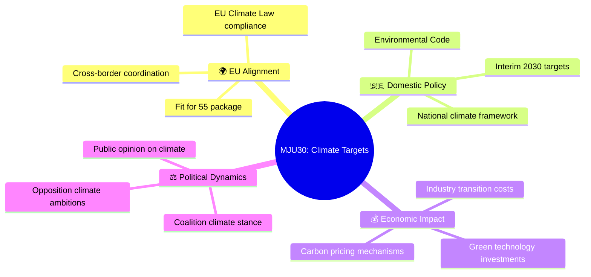
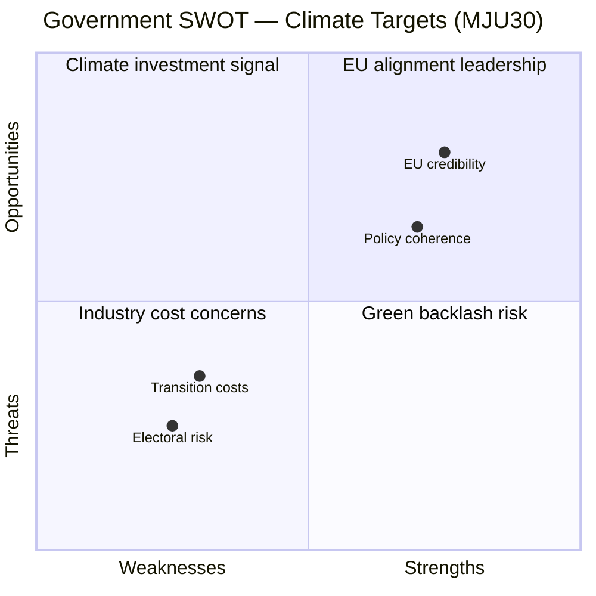

# Document Analysis: Sveriges klimatmål – EU-anpassade och ändamålsenliga etappmål till 2030

**Generated**: 2026-03-31 04:52 UTC
**dok_id**: HD01MJU30
**Document Type**: Betänkande (Committee Report)
**Committee**: MJU (Miljö- och jordbruksutskottet)
**Date**: 2026-03-30
**Riksmöte**: 2025/26
**Significance**: 🟡 Medium (5/10)
**Confidence**: MEDIUM (60%)

---

## Executive Summary

The Environment and Agriculture Committee (MJU) presents its report on Sweden's climate targets, specifically EU-adapted interim targets for 2030. This report represents a critical intersection of Swedish domestic climate policy with EU-level regulatory alignment, coming at a politically sensitive time as Sweden navigates the balance between ambitious climate action and economic competitiveness. The committee proposes adapting Swedish interim climate targets to align with EU frameworks while ensuring they remain fit for purpose.

## Policy Domain Analysis

## Evidence Table

| Evidence Point | Source | Detail |
|---|---|---|
| Committee report published | dok_id: HD01MJU30 | MJU betänkande 2025/26:MJU30, published 2026-03-30 |
| Status: Planned for debate | Riksdag API | Document status "planerat" — chamber debate scheduled |
| Related MJU work: Invasive species | dok_id: HD01MJU13 | MJU recently passed legislation on invasive species (2026-03-12) |
| Related MJU work: Dog control | dok_id: HD01MJU15 | MJU passed dog control legislation (2026-03-11) |
| Motion denial rate | CIA metrics | 96% of opposition motions denied this riksmöte |
| Coalition stability | CIA metrics | Coalition stability score: 83/100 |

## SWOT Analysis

### Government Perspective

#### Strengths 💪
- **EU regulatory alignment**: Adapting Swedish targets to EU framework demonstrates Sweden's commitment to the European Green Deal, strengthening its position in EU climate negotiations (dok_id: HD01MJU30)
- **Policy coherence**: Active MJU agenda this session with complementary environmental legislation including invasive species regulation (dok_id: HD01MJU13) and dog control reforms (dok_id: HD01MJU15)

#### Weaknesses ⚠️
- **Ambiguity on ambition level**: Title suggests "EU-adapted" targets which may signal a lowering of Swedish climate ambitions to match EU minimums rather than maintaining Sweden's historically higher standards
- **Metadata-only analysis**: Full-text unavailable limits assessment of specific target modifications

#### Opportunities 🌟
- **Green transition leadership**: Sweden can position itself as EU climate policy frontrunner by setting interim targets that exceed EU minimums while remaining economically viable
- **Cross-party consensus building**: Climate targets historically attract broader parliamentary support than many policy areas

#### Threats 🔴
- **Green backlash**: Environmental organisations may criticise "EU-adapted" framing as a retreat from Swedish climate leadership (confidence: MEDIUM)
- **Economic competitiveness concerns**: Industry stakeholders may resist tighter interim targets during economic uncertainty

### Opposition Perspective

#### Strengths 💪
- **Accountability leverage**: Opposition can scrutinise whether adapted targets represent genuine progress or political compromise

#### Threats 🔴
- **High motion denial rate (96%)**: Opposition amendments to strengthen climate targets face near-certain rejection (CIA metrics, rm 2025/26)

## Stakeholder Impact Analysis

| Stakeholder | Impact | Sentiment | Key Concern |
|---|---|---|---|
| 🏛️ Government | Medium | Positive | EU regulatory compliance and policy coherence |
| ⚖️ Opposition | Low-Medium | Neutral-Critical | Whether targets represent ambition reduction |
| 👥 Environmental NGOs | Medium | Cautious | "EU-adapted" may dilute Swedish leadership |
| 💰 Industry | Medium | Mixed | Transition costs vs. regulatory certainty |
| 🌍 EU institutions | Low | Positive | Swedish alignment with EU Climate Law |
| 📰 Media | Low-Medium | Monitoring | Climate policy is high public interest |

## Significance Assessment

**Overall Score**: 5/10 — 🟡 Medium

**Scoring Factors**:
- Committee tier: MJU (Tier 2 — policy-specific committee)
- Policy domain: Climate and environmental policy (high public salience)
- EU intersection: Cross-border regulatory alignment
- Timing: Pre-debate phase, full policy implications not yet clear
- Content richness: Metadata-only reduces confidence

## Forward Indicators

1. **Watch**: Chamber debate schedule for MJU30 — likely within 2-4 weeks
2. **Watch**: Voting results when debate concludes — party alignment on climate
3. **Monitor**: Environmental NGO reactions to "EU-adapted" framing
4. **Context**: Compare with earlier MJU work on environmental regulation this session

## Data Quality Notes

- **Analysis confidence**: MEDIUM (60%)
- **Full-text content**: Unavailable — analysis based on title, committee, and contextual data
- **Data sources**: get_betankanden, get_dokument_innehall
- **Analysis method**: 6-lens stakeholder analysis with SWOT, enhanced with committee context
