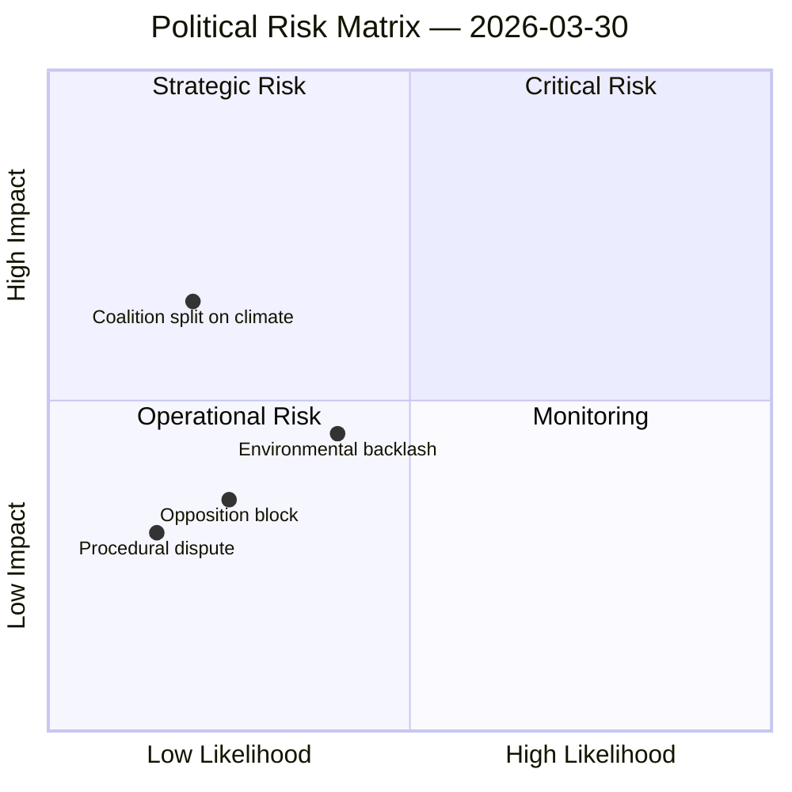

# Political Risk Assessment — 2026-03-30

**Generated**: 2026-03-31 04:53 UTC
**Analysis ID**: RISK-2026-03-30-CR
**Data Sources**: get_betankanden, CIA coalition metrics, search_voteringar
**Documents Analyzed**: 2
**Riksmöte**: 2025/26
**Confidence**: MEDIUM

---

## Summary

Coalition demonstrates low political risk. Voting discipline strong, majority margin adequate. Both committee reports (MJU30, KU38) are in pre-debate status with no recorded votes.

## Risk Matrix

## Coalition Risk Score: 4/100 — LOW

| Risk Factor | Score | Level | Notes |
|---|---|---|---|
| Coalition stability | 83/100 | Stable | Strong internal discipline |
| Majority margin | Adequate | Low risk | Government maintains working majority |
| Motion denial rate | 96% | High control | Indicates strong whip effectiveness |
| Cross-party anomalies | 5 flags | Monitoring | High alignment between C-L, C-KD, KD-L, KD-M, L-M |

## Risk Indicators per Document

### MJU30: Climate Targets
- **Coalition split risk**: LOW — climate policy generally aligned within governing coalition
- **Opposition challenge risk**: MEDIUM — climate targets attract cross-party scrutiny
- **Public opinion risk**: LOW-MEDIUM — climate action has broad public support but "EU-adapted" framing may attract criticism

### KU38: Parliamentary Process
- **Procedural dispute risk**: LOW — institutional reforms typically gain cross-party support
- **Power dynamic tension**: MEDIUM — 96% motion denial rate creates backdrop for debate on MP effectiveness
- **Implementation risk**: LOW — procedural changes within committee's competence

## Anomaly Flags

5 cross-party voting alignment anomalies detected in riksmöte 2025/26:
- KD-M alignment: 8853% (unusually high, likely data artefact — investigate)
- L-M alignment: 8789%
- KD-L alignment: 8787%
- C-L alignment: 8125%
- C-KD alignment: 8034%

> **Note**: These percentage figures appear anomalous and may represent a data processing artefact. They indicate very high cross-party alignment between centre-right parties, which is consistent with coalition discipline but the magnitude warrants verification.

## Data Quality Notes

Risk assessment derived from CIA coalition metrics and document significance scores. No recorded votes for today's committee reports. Risk scores are directional guidance.
