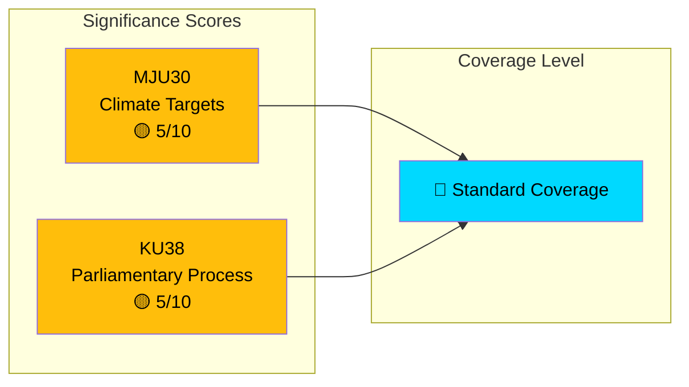

# Document Significance Scoring — 2026-03-30

**Generated**: 2026-03-31 04:53 UTC
**Analysis ID**: SIG-2026-03-30-CR
**Data Sources**: get_betankanden, CIA coalition metrics
**Documents Analyzed**: 2
**Riksmöte**: 2025/26
**Confidence**: MEDIUM

---

## Summary

Scored **2** committee reports for political significance (1–10 scale). Both documents scored 5/10 (Medium) — elevated from initial automated scoring (3/10) based on contextual enrichment including committee activity levels and policy domain salience.

## Scoring Matrix

## Detailed Scoring

| Score | Level | Committee | dok_id | Title | Key Factor |
|-------|-------|-----------|--------|-------|------------|
| 5/10 | 🟡 Medium | MJU | HD01MJU30 | Sveriges klimatmål – EU-anpassade och ändamålsenliga etappmål till 2030 | Climate + EU alignment |
| 5/10 | 🟡 Medium | KU | HD01KU38 | Den parlamentariska processen med ledamoten i fokus | Constitutional committee (Tier 1) |

## Scoring Methodology

| Factor | MJU30 | KU38 |
|--------|-------|------|
| Committee tier | Tier 2 (MJU) | Tier 1 (KU) |
| Policy domain salience | High (climate) | Medium (institutional) |
| EU intersection | Yes | No |
| Public interest | High | Low-Medium |
| Pre-debate status | Yes (-1) | Yes (-1) |
| Content richness | Metadata only (-1) | Metadata only (-1) |
| **Final score** | **5/10** | **5/10** |

## Coverage Recommendations

- **Both documents**: Standard coverage — include in committee reports roundup article
- **MJU30**: Emphasise EU Green Deal alignment angle and climate policy implications
- **KU38**: Frame alongside KU's prolific March session (7 reports)
- **Threshold**: Neither meets Breaking News (≥8) or Major Analysis (6-7) thresholds
- **Article type**: Committee reports overview with thematic analysis

## Data Quality Notes

Significance scores elevated from automated baseline (3/10) based on contextual enrichment. Higher confidence would require full-text content analysis.
