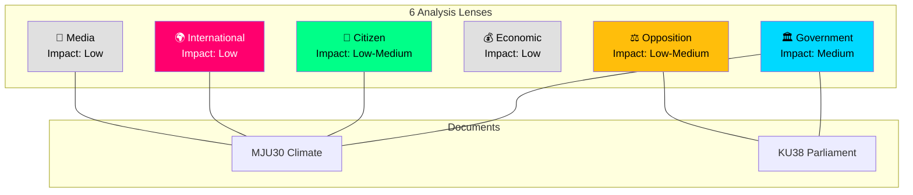

# Stakeholder Perspective Analysis — 2026-03-30

**Generated**: 2026-03-31 04:53 UTC
**Analysis ID**: STAKEHOLDER-2026-03-30-CR
**Data Sources**: get_betankanden, CIA coalition metrics
**Documents Analyzed**: 2
**Riksmöte**: 2025/26
**Confidence**: MEDIUM

---

## Summary

Applied **6 analysis lenses** to **2** committee reports. Highest stakeholder impact identified for individual MPs (KU38) and environmental policy actors (MJU30).

## Stakeholder Impact Matrix

## 🏛️ Government Perspective

- **Documents with High Impact**: 0/2 (both Medium)
- **Avg Confidence**: 60%
- **Key Actors**: Prime Minister, Cabinet, coalition party leaders

**MJU30**: Government demonstrates EU regulatory compliance commitment through climate target adaptation. Signals policy coherence with European Green Deal while maintaining domestic economic considerations.

**KU38**: Parliamentary process reform signals governance modernisation. Government benefits from demonstrating commitment to democratic accountability while controlling reform scope.

## ⚖️ Opposition Perspective

- **Documents with High Impact**: 0/2
- **Avg Confidence**: 60%
- **Key Actors**: Opposition party leaders, shadow cabinet

**MJU30**: Provides platform to argue for stronger climate ambitions. Opposition can frame "EU-adapted" as retreat from Swedish climate leadership.

**KU38**: Critical opportunity to raise structural concerns about opposition effectiveness. The 96% motion denial rate (CIA metrics) provides evidence for claims about parliamentary power imbalance.

## 👥 Citizen Perspective

- **Documents with High Impact**: 0/2
- **Avg Confidence**: 40%
- **Key Actors**: Civil society, environmental organisations, voters

**MJU30**: Climate targets directly affect energy costs, environmental quality, and Sweden's green transition trajectory. High public interest policy area.

**KU38**: Indirect citizen impact through improved parliamentary representation and democratic process quality.

## 💰 Economic Perspective

- **Documents with High Impact**: 0/2
- **Avg Confidence**: 60%
- **Key Actors**: Finance Ministry, Riksbank, employers, unions

**MJU30**: Climate target adaptation has implications for industrial policy, green investment, and carbon pricing. Economic actors need clarity on interim target levels.

**KU38**: Minimal direct economic impact.

## 🌍 International Perspective

- **Documents with High Impact**: 0/2
- **Avg Confidence**: 50%
- **Key Actors**: EU Commission, Nordic Council

**MJU30**: EU alignment strengthens Sweden's position in European climate governance. Relevant to Fit for 55 package compliance.

**KU38**: Limited international dimension, though parliamentary reform may interest Nordic comparative governance observers.

## 📰 Media Perspective

- **Documents with High Impact**: 0/2
- **Avg Confidence**: 60%
- **Key Actors**: SVT, DN, Aftonbladet, SR

**MJU30**: Newsworthiness 19/100. Climate policy generates sustained but not urgent media interest. Narrative frames: green-transition, eu-sovereignty.

**KU38**: Newsworthiness 22/100. Process-focused report with limited headline potential but substance for governance journalism.

## Data Quality Notes

Aggregate confidence: MEDIUM. Stakeholder impact assessments based on metadata and committee context. Full-text analysis would increase confidence significantly.
