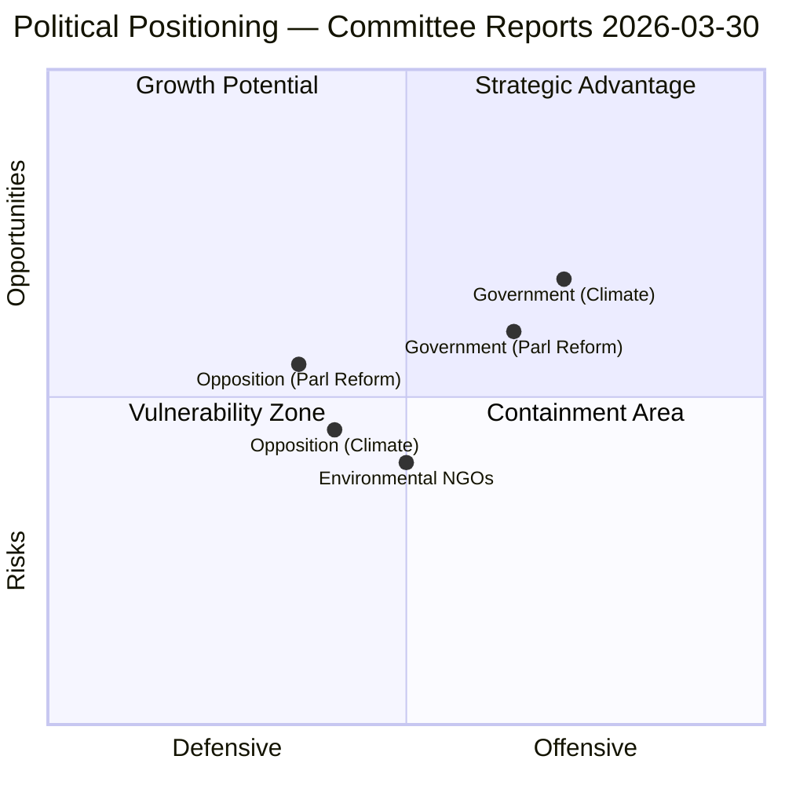

# Political SWOT Analysis — 2026-03-30

**Generated**: 2026-03-31 04:53 UTC
**Analysis ID**: SWOT-2026-03-30-CR
**Data Sources**: get_betankanden, CIA coalition metrics
**Documents Analyzed**: 2
**Riksmöte**: 2025/26
**Confidence**: MEDIUM

---

## Summary

SWOT analysis for **5** political actors based on 2 committee reports (MJU30: climate targets, KU38: parliamentary process). Analysis considers coalition stability (83/100), motion denial rate (96%), and policy domain implications.

## SWOT Overview

## Government

### Strengths 💪
- EU regulatory alignment through MJU30 demonstrates international policy coherence (dok_id: HD01MJU30)
- Prolific KU activity (7 reports in March) signals strong governance capacity (dok_ids: HD01KU38, HD01KU31, HD01KU29, HD01KU30)
- Coalition stability score 83/100 provides secure legislative majority

### Weaknesses ⚠️
- "EU-adapted" climate targets may be perceived as ambition reduction from Swedish climate leadership
- Parliamentary process report risks being seen as procedural rather than substantive

### Opportunities 🌟
- Climate targets alignment positions Sweden favourably in EU Green Deal negotiations
- Parliamentary reform could enhance democratic legitimacy ahead of 2026 election cycle
- Cross-party consensus potential on institutional reforms

### Threats 🔴
- Environmental lobby criticism of target adaptation approach
- Process reforms may expose power asymmetries with 96% motion denial rate

## Opposition

### Strengths 💪
- Accountability platform through KU38 debate on parliamentary process and MP role
- Climate policy debate offers high public visibility

### Weaknesses ⚠️
- 96% motion denial rate limits legislative effectiveness regardless of procedural reforms
- Structural power disadvantage in committee stage

### Opportunities 🌟
- KU38 debate enables raising concerns about opposition effectiveness in parliamentary system
- Climate targets debate resonates with environmentally conscious voters

### Threats 🔴
- Reforms may be cosmetic without addressing fundamental power dynamics
- Coalition discipline makes amendment passage near-impossible

## Environmental Actors

### Strengths 💪
- Climate "klimat" keyword aligns with high public agenda salience
- Strong scientific evidence base for climate advocacy

### Weaknesses ⚠️
- "EU-adapted" framing may lower baseline expectations

### Opportunities 🌟
- MJU30 debate provides platform for pushing higher ambition
- EU-level climate legislation creates reinforcing regulatory pressure

### Threats 🔴
- Risk of climate fatigue in public discourse

## Media & Public

### Strengths 💪
- Climate policy generates sustained public interest (newsworthiness: 19/100 for MJU30)
- Parliamentary process reform has democratic governance angle

### Opportunities 🌟
- Both reports offer analysis angles beyond straightforward policy coverage

### Threats 🔴
- Process-focused reports may struggle for public attention

## International Actors

### Strengths 💪
- EU alignment through MJU30 strengthens Sweden's European credibility

### Opportunities 🌟
- Swedish parliamentary reform may serve as model for other Nordic parliaments

## Data Quality Notes

SWOT confidence: MEDIUM. Analysis based on metadata, committee context, and CIA coalition metrics. Full-text unavailable for both documents.
