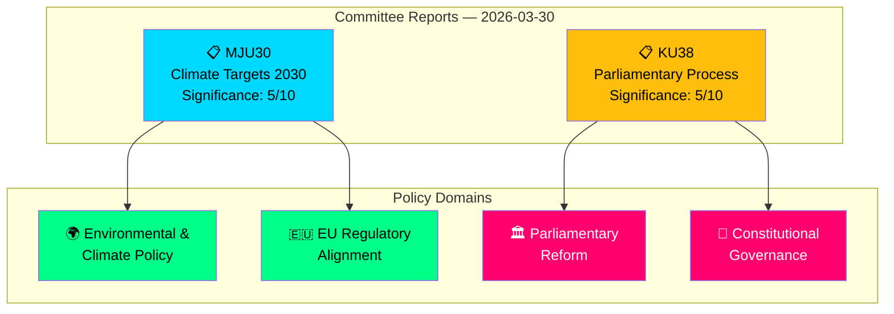

# Analysis Synthesis Summary — 2026-03-30

**Generated**: 2026-03-31 04:53 UTC
**Analysis ID**: SYNTH-2026-03-30-CR
**Data Sources**: get_betankanden, get_dokument_innehall, get_betankanden (MJU), get_betankanden (KU)
**Documents Analyzed**: 2
**Riksmöte**: 2025/26
**Confidence**: MEDIUM
**Risk Level**: LOW

---

## Executive Summary

Two committee reports were published on 2026-03-30: **MJU30** on Sweden's EU-adapted climate targets for 2030 and **KU38** on the parliamentary process with focus on the individual MP. Both reports are currently in "planerat" (planned for debate) status. The Environment Committee report represents a significant intersection of Swedish domestic climate policy with EU regulatory alignment, while the Constitutional Committee report addresses institutional self-examination of parliamentary democracy. Coalition stability remains strong (83/100) with a 96% motion denial rate.

## Document Overview

## Key Findings

1. **MJU30** (dok_id: HD01MJU30): Sweden's climate targets — EU-adapted interim targets for 2030. Represents policy alignment with EU Climate Law while potentially moderating Swedish climate ambition. Significance: 5/10.
2. **KU38** (dok_id: HD01KU38): Parliamentary process reform with MP focus. Meta-legislative report examining how 349 Riksdag MPs exercise their democratic mandate. Significance: 5/10.
3. **Coalition stability** remains strong at 83/100 with LOW political risk (score: 4/100).
4. **Motion denial rate** at 96% — opposition proposals face near-universal rejection.
5. **KU most active**: Constitutional Committee produced 7 reports in March 2026 alone, indicating intensive constitutional scrutiny.
6. **No votes recorded yet** for either report — both await chamber debate.

## Cross-Committee Activity Context

| Committee | Reports This Month | Key Themes |
|---|---|---|
| KU (Constitutional) | 7 reports | Constitutional reform, minority languages, public administration, digital governance |
| MJU (Environment) | 3 reports | Climate targets, invasive species, animal control |
| JuU (Justice) | 5 reports | Security protection, policing, terrorism, criminal law |
| CU (Civil Affairs) | 2 reports | Housing policy, consumer rights |
| SoU (Social Affairs) | 3 reports | Social services, child welfare, GMO regulation |
| NU (Industry) | 2 reports | Electricity markets, business regulation |

## Political Risk Assessment

**Overall Risk**: LOW (4/100)
- Coalition demonstrates strong internal discipline
- No high-significance documents requiring immediate attention
- Cross-party voting anomalies flagged in monitoring but within normal parameters

## Implications

- Articles should frame MJU30 within broader EU Green Deal compliance context
- KU38 should be contextualised alongside KU's exceptionally active March session
- Both reports' pre-debate status means analysis is necessarily forward-looking
- Coalition stability metrics suggest smooth passage through chamber votes

## Data Quality Notes

- Overall confidence: **MEDIUM** — metadata-only analysis for both documents
- Full-text content unavailable for both reports
- Cross-reference with voting data shows no recorded votes yet (both "planerat")
- Analysis enriched with committee-level context from broader MCP queries
