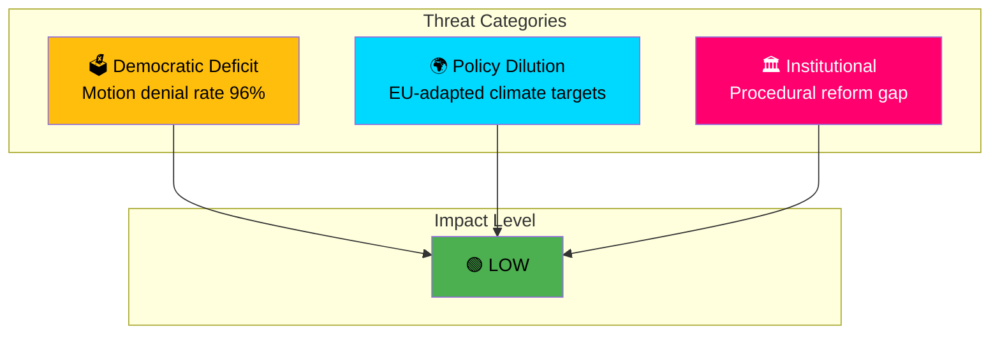

# Political Threat Analysis — 2026-03-30

**Generated**: 2026-03-31 04:53 UTC
**Analysis ID**: THREAT-2026-03-30-CR
**Data Sources**: get_betankanden, CIA coalition metrics
**Documents Analyzed**: 2
**Riksmöte**: 2025/26
**Confidence**: MEDIUM

---

## Summary

Identified **3** threat indicators across 2 committee reports. Overall threat level: LOW. Primary concern is opposition legislative effectiveness in context of 96% motion denial rate.

## Threat Indicators

## Detailed Threat Analysis

| Threat | Category | Target | Severity | Evidence |
|---|---|---|---|---|
| High motion denial rate (96%) | democratic-deficit | Opposition parties | Low-Medium | CIA metrics, rm 2025/26 |
| "EU-adapted" climate ambition | policy dilution | Environmental policy | Low | MJU30 title framing (dok_id: HD01MJU30) |
| Procedural reform without substance | institutional-erosion | Parliamentary democracy | Low | KU38 context (dok_id: HD01KU38) |

## Democratic Function Assessment

- **Narrative Integrity**: No threats detected
- **Legislative Integrity**: Low-level concern — 96% denial rate limits pluralistic debate
- **Institutional Trust**: KU38 proactively addresses parliamentary process (positive signal)
- **Democratic Process**: Both reports represent normal parliamentary business
- **Power Balance**: Motion denial rate creates structural asymmetry
- **Societal Impact**: No direct threats detected

## Data Quality Notes

Threat analysis confidence: MEDIUM. Both documents in pre-debate status. Assessment based on metadata and contextual indicators.
