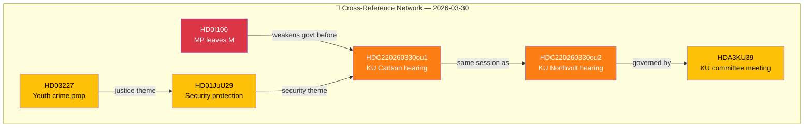

# 🔗 Cross-Reference Map — 2026-03-30

## 📋 Cross-Reference Context

| Field | Value |
|-------|-------|
| **Map ID** | `XRF-2026-03-30-001` |
| **Assessment Date** | `2026-03-30 01:14 UTC` |
| **Produced By** | news-realtime-monitor |

---

## 🔗 Event Relationship Network

| Source Event | Related Event | Relationship | Strength |
|-------------|---------------|--------------|:--------:|
| HD0I100 (MP defection) | HDC220260330ou1 (KU hearing) | Temporal + coalition impact | HIGH |
| HDC220260330ou1 (Carlson) | HDC220260330ou2 (Holm) | Same KU session | HIGH |
| HD01JuU29 (Security) | HDC220260330ou1 (Lantmäteriet) | Security theme | MEDIUM |
| HD03227 (Youth crime) | HD03213 (Honour violence) | Justice reform package | MEDIUM |

---

**Document Control:**
- **Classification:** Public
