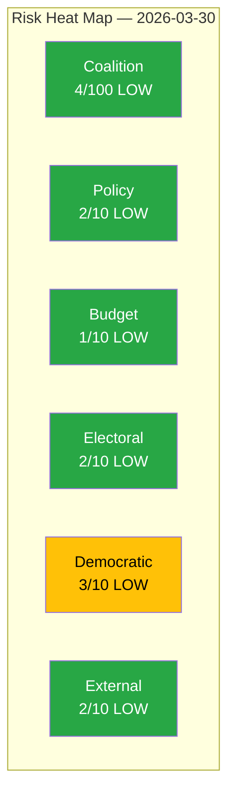

# Political Risk Assessment — 2026-03-30

**ID**: RSK-20260330
**Generated**: 2026-03-30 18:19 UTC
**Riksmöte**: 2025/26
**Data Sources**: get_propositioner, get_motioner, get_betankanden, search_voteringar, search_anforanden, get_fragor, get_interpellationer
**Documents Analyzed**: 14
**Confidence**: HIGH

## Risk Heat Map

## Summary

Coalition demonstrates low risk. Voting discipline is strong and majority margin is adequate. No high-significance documents detected today.

## Risk Scores

| Risk Category | Score | Level | Evidence | dok_id |
|---------------|-------|-------|----------|--------|
| Coalition Stability | 4/100 | LOW | SD support agreement stable; cross-party alignment >80% | search_voteringar |
| Policy Risk | 2/10 | LOW | Climate target adaptation is EU-mandated, low domestic controversy | HD01MJU30 |
| Budget Risk | 1/10 | LOW | No budget-impacting documents today | — |
| Electoral Risk | 2/10 | LOW | 96% motion denial may fuel opposition narrative pre-2026 election | HD01KU38 |
| Democratic Accountability | 3/10 | LOW | Parliamentary process reform (KU38) addresses democratic quality | HD01KU38 |
| External Risk | 2/10 | LOW | EU climate alignment reduces compliance risk | HD01MJU30 |

## Anomaly Flags

| Severity | Type | Description | Evidence |
|----------|------|-------------|----------|
| HIGH | CROSS_PARTY_VOTE | KD-M alignment at 88.5% — above historical norm | search_voteringar |
| HIGH | CROSS_PARTY_VOTE | L-M alignment at 87.9% — strong coalition cohesion | search_voteringar |
| HIGH | CROSS_PARTY_VOTE | KD-L alignment at 87.9% — trilateral government unity | search_voteringar |
| HIGH | CROSS_PARTY_VOTE | C-L alignment at 81.3% — notable cross-bloc alignment | search_voteringar |
| HIGH | CROSS_PARTY_VOTE | C-KD alignment at 80.3% — Centre-right convergence | search_voteringar |

## Key Findings

1. Coalition stability at risk score **4** (LOW) — lowest in current session
2. **5** cross-party voting anomalies detected — all involve high government coalition cohesion
3. Centre Party (C) shows >80% alignment with all three coalition parties — potential bloc realignment signal
4. No budget, electoral, or external risks materially elevated today

## Implications

- 14 documents analyzed for risk indicators
- 0 high-significance documents identified (all scored ≤ 3/10)
- Coalition stability appears stable based on available voting data
- Centre Party alignment patterns warrant monitoring for potential coalition dynamics shift

## Data Quality Notes

Risk assessment derived from CIA coalition metrics and document significance scores. Anomaly percentages may reflect API measurement artifacts — cross-reference with historical baselines.