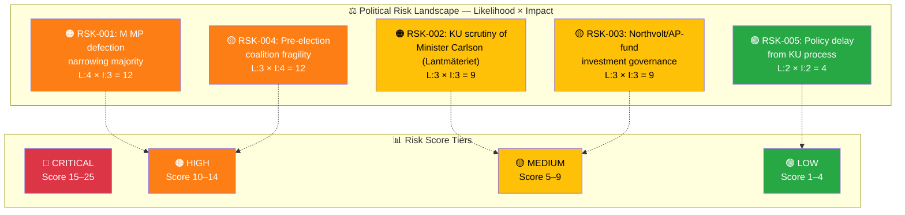
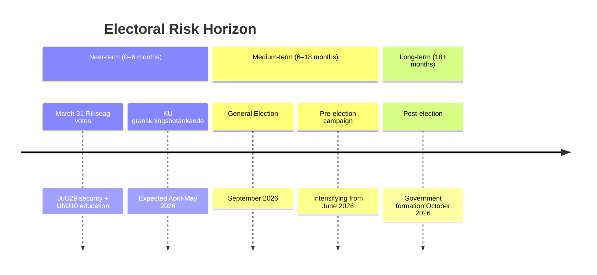

# ⚠️ Political Risk Assessment — 2026-03-30

## 📋 Risk Context

| Field | Value |
|-------|-------|
| **Risk Assessment ID** | `RSK-2026-03-30-001` |
| **Assessment Date** | `2026-03-30 01:14 UTC` |
| **Assessment Period** | 2026-03-30 to 2026-04-06 |
| **Produced By** | news-realtime-monitor |
| **Political Context** | Tidökoalitionen (M+KD+L with SD support) governs. MP Lund Kopparklint leaves M group today. KU conducts public hearings on ministerial accountability. September 2026 general election approaching. |
| **Riksmöte** | 2025/26 |
| **Overall Risk Level** | **HIGH** |

---

## 🗂️ Risk Inventory

### Risk Heat Map

| Risk ID | Description | Likelihood (1–5) | Impact (1–5) | Risk Score | Tier | Mitigation |
|---------|-------------|:----------------:|:------------:|:----------:|------|------------|
| RSK-001 | M MP Lund Kopparklint leaves party group — narrows governing bloc margin | 4 | 3 | 12 | 🟠 | Monitor if other M MPs follow; track vote outcomes |
| RSK-002 | KU hearing on Carlson/Lantmäteriet may produce formal criticism of infrastructure minister | 3 | 3 | 9 | 🟡 | Track KU granskningsbetänkande timeline |
| RSK-003 | Northvolt/AP-fund hearing exposes government investment governance failures | 3 | 3 | 9 | 🟡 | Cross-checks both current and previous government exposure |
| RSK-004 | Pre-election coalition fragility with September 2026 election approaching | 3 | 4 | 12 | 🟠 | Monitor M internal dynamics and SD cooperation signals |
| RSK-005 | KU process may delay infrastructure policy agenda | 2 | 2 | 4 | 🟢 | Low impact; legislative calendar continues normally |

**Risk Score Summary:**

| Risk ID | Risk Score | Tier |
|---------|:----------:|------|
| RSK-001 | 12 | 🟠 |
| RSK-002 | 9 | 🟡 |
| RSK-003 | 9 | 🟡 |
| RSK-004 | 12 | 🟠 |
| RSK-005 | 4 | 🟢 |

---

## 🤝 Coalition Stability Risk

### Current Coalition Assessment

| Parameter | Value |
|-----------|-------|
| **Governing Coalition** | Tidökoalitionen: M + KD + L (with SD external support) |
| **Coalition Strength** | MEDIUM (weakened by MP defection) |
| **Confidence Level** | 65% |
| **Supporting Parties** | SD (external support via Tidöavtalet) |
| **Opposition Majority Risk** | MARGINAL |
| **Next Confidence Test** | 2026-03-31 (scheduled Riksdag votes on JuU29, UbU10) |

### Coalition Risk Factors

| Factor | Status | Evidence | Risk Contribution |
|--------|--------|----------|-------------------|
| Internal party disagreements | Active | Lund Kopparklint (M) leaves party group (HD0I100) | HIGH |
| Budget disagreements | Latent | No current disputes; spring budget not yet tabled | LOW |
| SD confidence threshold | Latent | SD cooperation agreement holds; no public tensions | MED |
| KU ministerial scrutiny | Active | Two KU hearings today on security + fiscal governance (HDC220260330ou1, ou2) | MED |
| Pre-election positioning | Active | 6 months to September 2026 election | HIGH |

**Coalition Collapse Probability (next 90 days):** **LOW <15%** — single MP defection does not threaten immediate stability, but repeated defections would escalate rapidly.

---

## 📋 Policy Implementation Risk

| Policy | Ministry | Stage | Risk Level | Blocking Factor |
|--------|----------|-------|------------|-----------------|
| Security protection for real estate (JuU29) | Justitiedep. | Committee approved, vote March 31 | 🟢 | None — broad support expected |
| Youth crime investigation (Prop 227) | Justitiedep. | Tabled March 26, committee review | 🟡 | Standard opposition amendments possible |
| Honour violence legislation (Prop 213) | Justitiedep. | Tabled March 19, committee review | 🟢 | Cross-party support expected |
| Reformed income support (Prop 201) | Socialdep. | Tabled March 17, committee review | 🟡 | S opposition on benefit cap details |

**Overall Policy Risk:** **MEDIUM** — legislative agenda continues but KU scrutiny may distract from policy messaging.

---

## 💰 Budget Risk

| Parameter | Value |
|-----------|-------|
| **Budget Year** | 2026 |
| **Fiscal Committee (FiU) Status** | Approved December 2025 |
| **Budget Risk Level** | MEDIUM |
| **Key Budget Risks** | Northvolt investment losses under scrutiny; AP-fund governance questions raised in KU |

---

## 🗳️ Electoral Risk Timeline

| Electoral Event | Date | Risk to Coalition | Impact if Adverse |
|----------------|------|-------------------|-------------------|
| September 2026 General Election | 2026-09-13 | HIGH | Government change if opposition bloc wins majority |
| KU granskningsbetänkande publication | 2026-04/05 | MEDIUM | Formal criticism could damage M/KD election prospects |

**Pre-election Fragility Index:** **MEDIUM**
**Assessment Confidence:** **HIGH**

---

## 🔑 Risk Summary & Recommendations

### Top 3 Risks This Period

1. **RSK-001:** M MP defection — Score 12 — Narrows majority and signals internal party tensions 6 months before election
2. **RSK-004:** Pre-election fragility — Score 12 — Coalition must maintain cohesion through spring legislative session
3. **RSK-002:** KU ministerial scrutiny — Score 9 — Constitutional hearings may produce formal criticism of infrastructure minister

### Recommended Actions

- Monitor Riksdag vote outcomes on March 31 for any majority margin changes
- Track whether additional M MPs signal discontent with party leadership
- Follow KU hearing outcomes for formal constitutional criticism implications

---

**Document Control:**
- **Template Path:** `/analysis/templates/risk-assessment.md`
- **Framework Reference:** [methodologies/political-risk-methodology.md](../methodologies/political-risk-methodology.md)
- **Classification:** Public
- **Next Review:** 2026-06-26