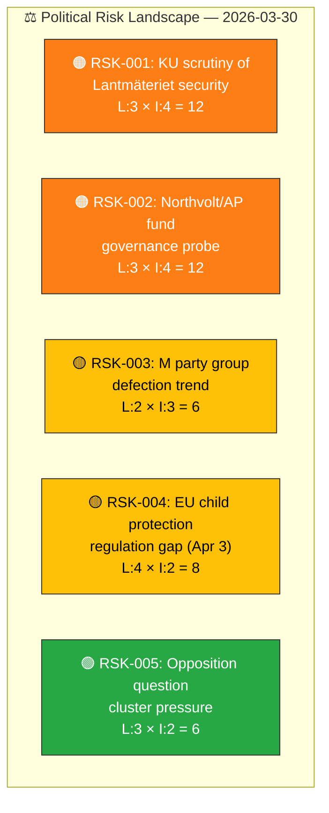

# ⚠️ Political Risk Assessment — 2026-03-30

**📋 Document Owner:** CEO | **📄 Version:** 1.0 | **📅 Last Updated:** 2026-03-30 (UTC)
**🏢 Owner:** Hack23 AB (Org.nr 5595347807) | **🏷️ Classification:** Public

---

## 📋 Risk Context

| Field | Value |
|-------|-------|
| **Risk Assessment ID** | `RSK-2026-03-30-001` |
| **Assessment Date** | `2026-03-30 10:33 UTC` |
| **Assessment Period** | 2026-03-30 to 2026-04-06 |
| **Produced By** | `news-realtime-monitor` |
| **Political Context** | Tidöblocket (M+KD+L with SD supply) governs with working majority. KU scrutiny hearings today on Northvolt/AP and Lantmäteriet security. One M MP has left the party group. |
| **Riksmöte** | 2025/26 |
| **Overall Risk Level** | **MEDIUM** |

---

## 🗂️ Risk Inventory

### Risk Heat Map

### Detailed Risk Register

| Risk ID | Risk Description | Likelihood (1-5) | Impact (1-5) | Score | Tier | Evidence (dok_id) | Mitigation | Confidence |
|---------|-----------------|:-----------------:|:------------:|:-----:|:----:|-------------------|-----------|:----------:|
| RSK-001 | KU hearing on Lantmäteriet security may reveal ministerial negligence, damaging government credibility on national security | 3 | 4 | **12** | 🟠 HIGH | HDC220260330ou1, HDA7KU38 | Minister Carlson prepared testimony; government can argue process improvements underway | `[HIGH]` |
| RSK-002 | Northvolt/AP fund probe may establish that state investment governance was inadequate, with potential fiscal policy implications | 3 | 4 | **12** | 🟠 HIGH | HDC220260330ou2 | Previous government bears primary responsibility; current government can distance | `[MEDIUM]` |
| RSK-003 | M party group defection may signal internal tensions ahead of 2026 election; could embolden other dissatisfied MPs | 2 | 3 | **6** | 🟡 MEDIUM | HD0I100 | Isolated event unless pattern emerges; M party leadership can reassert discipline | `[HIGH]` |
| RSK-004 | EU temporary legislation on child abuse detection expires April 3; government under pressure to present position before Easter | 4 | 2 | **8** | 🟡 MEDIUM | HD11664 | Government can defer to ongoing EU Council negotiations; S question increases domestic pressure | `[MEDIUM]` |
| RSK-005 | Sustained multi-domain opposition questioning creates cumulative pressure across policy areas | 3 | 2 | **6** | 🟡 MEDIUM | HD11661-HD11666 | Normal parliamentary scrutiny; answering ministers can use positive legislative track record | `[HIGH]` |

---

## 📊 Risk Trend Assessment

| Period | Coalition Risk Score | Trend | Key Driver |
|--------|:-------------------:|:-----:|-----------|
| 2026-W12 | 4/100 | → | Routine legislative period |
| 2026-W13 | 8/100 | ↗ | KU hearing schedule confirmed |
| **2026-W14** | **15/100** | **↗** | KU hearings + M defection |

---

## 📋 Document Control

| Field | Value |
|-------|-------|
| **Classification** | Public |
| **Retention** | 90 days |
| **Next Update** | 2026-03-30 evening risk update |
