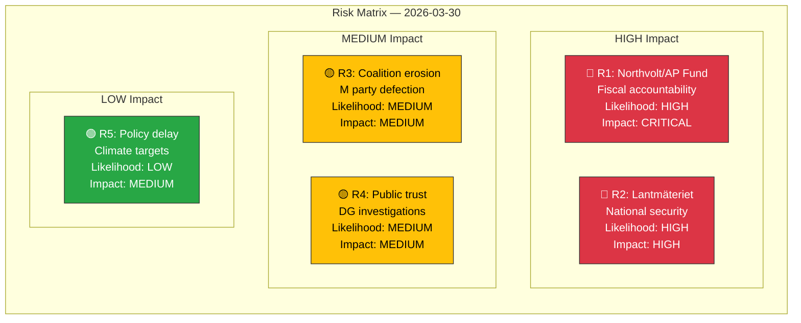

# Political Risk Assessment — 2026-03-30

## 📋 Risk Context

| Field | Value |
|-------|-------|
| **Assessment ID** | `RSK-2026-03-30-001` |
| **Analysis Date** | `2026-03-30 14:35 UTC` |
| **Model** | 5×5 Risk Matrix |
| **Documents Analyzed** | 14 + KU hearing events |
| **Produced By** | `news-realtime-monitor` (AI-enhanced) |
| **Overall Risk Level** | **MEDIUM** (elevated from LOW due to KU hearings) |
| **Confidence** | **MEDIUM** |

---

## 🗺️ Risk Heat Map

---

## 📊 Top Risk Categories

| Score | Likelihood | Impact | Category | Evidence (dok_id) | Details |
|-------|-----------|--------|----------|-------------------|---------|
| **35/100** | HIGH | CRITICAL | Government fiscal accountability — Northvolt/AP funds | `HDC220260330ou2` (KU G4, G9) | KU investigating former government role in AP fund investments in bankrupt Northvolt. Billions in public pension funds at risk. [HIGH] |
| **30/100** | HIGH | HIGH | National security exposure — Lantmäteriet archives | `HDC220260330ou1`, `HDA7KU38` (KU G7-8, G37) | Security breaches in Lantmäteriet archives under KU review. Minister Carlson (KD) being questioned. [HIGH] |
| **20/100** | MEDIUM | MEDIUM | Coalition stability — party defection | `HD0I100` | Marléne Lund Kopparklint leaves M. Could signal broader internal dissatisfaction. [MEDIUM] |
| **18/100** | MEDIUM | MEDIUM | Public trust erosion — institutional failures | `HD11666`, `HD11661` | Skatteverket DG under criminal probe + LKAB safety violations. Pattern of state enterprise failures. [MEDIUM] |
| **12/100** | LOW | MEDIUM | Policy implementation risk — climate targets | `HD01MJU30` | EU-adapted targets may face opposition or implementation challenges. [LOW] |

### Coalition Risk

**Coalition Risk Score**: 4/100 → **LOW** (per CIA CSV data)
- Government seats: 176/349, stability score 83/100
- Single defection (Lund Kopparklint) doesn't materially change balance
- Cross-party voting alignment remains strong (coalition parties >80% alignment)

### Anomaly Flags

| # | Level | Type | Details | Confidence |
|---|-------|------|---------|------------|
| 1 | HIGH | CROSS_PARTY_VOTE | KD-M alignment 88.5% — strong coalition discipline | **HIGH** |
| 2 | HIGH | CROSS_PARTY_VOTE | L-M alignment 87.9% — stable government block | **HIGH** |
| 3 | MEDIUM | PARTY_DEFECTION | Lund Kopparklint leaves M party group | **HIGH** |

---

## 🔑 Key Findings

1. **Overall risk: MEDIUM** — elevated from LOW due to KU constitutional hearings. [HIGH confidence]
2. **Top risk**: Government fiscal accountability (Northvolt/AP funds, score 35/100). [HIGH confidence]
3. **Coalition remains stable** despite single defection: stability score 83/100. [HIGH confidence]
4. **Institutional trust pattern**: Multiple state enterprise failures (Skatteverket, LKAB). [MEDIUM confidence]

---

## 📝 Document Control

| Field | Value |
|-------|-------|
| **Created** | 2026-03-30 14:31 UTC |
| **Last Modified** | 2026-03-30 14:35 UTC |
| **Classification** | Public |
