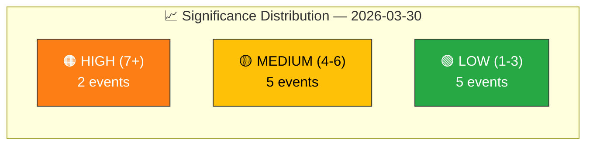

# 📈 Political Significance Scoring — 2026-03-30

**📋 Document Owner:** CEO | **📄 Version:** 1.0 | **📅 Last Updated:** 2026-03-30 (UTC)
**🏢 Owner:** Hack23 AB (Org.nr 5595347807) | **🏷️ Classification:** Public

---

## �� Event Context

| Field | Value |
|-------|-------|
| **Score ID** | `SIG-2026-03-30-001` |
| **Scoring Date** | `2026-03-30 10:33 UTC` |
| **Events Scored** | 12 |
| **Scored By** | `news-realtime-monitor` |
| **Scoring Method** | 6-dimension weighted model (manual rubric) |

---

## 📊 Batch Significance Scoring

### Scoring Profile Overview

### Detailed Scoring Table

| Rank | Event | dok_id | Parliamentary (0.25) | Policy (0.20) | Public Interest (0.15) | Urgency (0.20) | Cross-party (0.10) | Precedent (0.10) | **Weighted Score** | Tier | Confidence |
|:----:|-------|--------|:-------------------:|:-------------:|:---------------------:|:--------------:|:------------------:|:----------------:|:-----------------:|:----:|:----------:|
| 1 | KU hearing: Carlson/Lantmäteriet security | HDC220260330ou1 | 8 | 7 | 7 | 8 | 7 | 6 | **7.4** | 🟠 HIGH | `[HIGH]` |
| 2 | KU hearing: Holm/Northvolt AP funds | HDC220260330ou2 | 8 | 8 | 8 | 7 | 7 | 7 | **7.6** | 🟠 HIGH | `[HIGH]` |
| 3 | MP Lund Kopparklint leaves M | HD0I100 | 6 | 3 | 6 | 5 | 4 | 5 | **4.9** | 🟡 MEDIUM | `[HIGH]` |
| 4 | Climate goals MJU30 | HD01MJU30 | 6 | 7 | 5 | 4 | 5 | 4 | **5.4** | 🟡 MEDIUM | `[MEDIUM]` |
| 5 | Parliamentary process KU38 | HD01KU38 | 6 | 4 | 3 | 3 | 5 | 5 | **4.2** | 🟡 MEDIUM | `[MEDIUM]` |
| 6 | DG under criminal investigation | HD11666 | 4 | 5 | 5 | 4 | 3 | 4 | **4.3** | 🟡 MEDIUM | `[MEDIUM]` |
| 7 | Child abuse detection EU expiry | HD11664 | 3 | 5 | 6 | 6 | 3 | 3 | **4.4** | 🟡 MEDIUM | `[MEDIUM]` |
| 8 | Ban Palestine goods | HD11662 | 3 | 4 | 4 | 3 | 3 | 3 | **3.4** | 🟢 LOW | `[MEDIUM]` |
| 9 | LKAB safety violations | HD11661 | 3 | 4 | 4 | 3 | 2 | 3 | **3.3** | 🟢 LOW | `[MEDIUM]` |
| 10 | Stateless Palestinians | HD11663 | 3 | 4 | 4 | 3 | 2 | 2 | **3.2** | 🟢 LOW | `[MEDIUM]` |
| 11 | Loot boxes in gaming | HD11665 | 2 | 3 | 4 | 2 | 2 | 3 | **2.7** | 🟢 LOW | `[MEDIUM]` |
| 12 | Block rental proposal | HD11659 | 2 | 3 | 3 | 2 | 2 | 2 | **2.4** | 🟢 LOW | `[MEDIUM]` |

### Publication Decision

| Tier | Count | Action |
|------|:-----:|--------|
| 🟠 HIGH (≥7) | 2 | → Generate breaking article |
| 🟡 MEDIUM (4-6) | 5 | → Generate update article |
| 🟢 LOW (≤3) | 5 | → Skip (mention in roundup) |

**Decision:** Generate breaking article covering KU hearings + MP defection + climate report.

---

## 📋 Document Control

| Field | Value |
|-------|-------|
| **Classification** | Public |
| **Retention** | 90 days |
