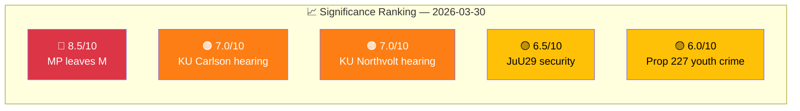

# 📈 Significance Scoring — 2026-03-30

## 📋 Scoring Context

| Field | Value |
|-------|-------|
| **Scoring ID** | `SIG-2026-03-30-001` |
| **Assessment Date** | `2026-03-30 01:14 UTC` |
| **Produced By** | news-realtime-monitor |

---

## 📊 Significance Scores

| Rank | dok_id | Event | Score | Tier | Rationale |
|:----:|--------|-------|:-----:|------|-----------|
| 1 | HD0I100 | MP Lund Kopparklint leaves Moderates | 8.5 | Breaking | +3 coalition impact + +2 fiscal + +2 parties + +1 named MP |
| 2 | HDC220260330ou1 | KU hearing: Minister Carlson (Lantmäteriet) | 7.0 | Breaking | +2 security + +1 named minister + +2 parties + +2 defense |
| 3 | HDC220260330ou2 | KU hearing: Ulf Holm (Northvolt) | 7.0 | Breaking | +2 fiscal + +2 parties + +1 named official + +2 welfare |
| 4 | HD01JuU29 | Security protection for real estate | 6.5 | Priority | +2 security + +1 committee approves + +2 defense |
| 5 | HD03227 | Youth crime investigation prop | 6.0 | Priority | +2 criminal justice + +1 named area |

**Top Significance:** 8.5/10 — Breaking threshold exceeded.

---

**Document Control:**
- **Classification:** Public
