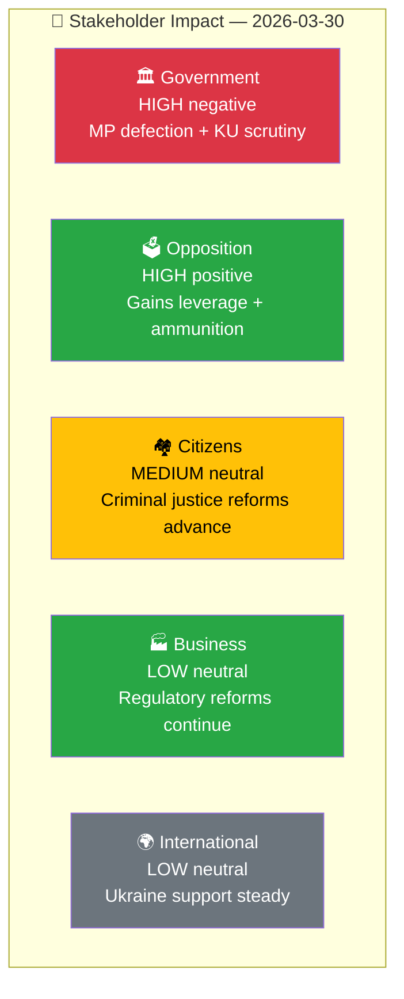

# 👥 Stakeholder Perspectives — 2026-03-30

## 📋 Stakeholder Context

| Field | Value |
|-------|-------|
| **Assessment ID** | `STK-2026-03-30-001` |
| **Assessment Date** | `2026-03-30 01:14 UTC` |
| **Produced By** | news-realtime-monitor |

---

## 👥 Stakeholder Impact Matrix

| Stakeholder | Impact | Direction | Key Driver | Evidence |
|------------|:------:|:---------:|------------|----------|
| 🏛️ Government | HIGH | Negative | MP defection narrows majority; KU hearings expose vulnerabilities | HD0I100, HDC220260330ou1/ou2 |
| 🗳️ Opposition | HIGH | Positive | M internal weakness creates electoral opportunity | HD0I100 |
| 🏘️ Citizens | MEDIUM | Neutral | Criminal justice reforms (Prop 227, 213) strengthen safety | HD03227, HD03213 |
| 🏭 Business | LOW | Neutral | Regulatory reforms continue | HD03221, HD03187 |
| 🌍 International | LOW | Neutral | Ukraine support reaffirmed | HD03162 |

---

**Document Control:**
- **Classification:** Public
