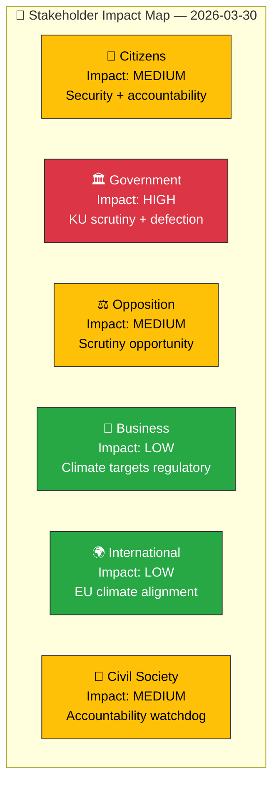

# 👥 Stakeholder Impact Assessment — 2026-03-30

**📋 Document Owner:** CEO | **📄 Version:** 1.0 | **📅 Last Updated:** 2026-03-30 (UTC)
**🏢 Owner:** Hack23 AB (Org.nr 5595347807) | **🏷️ Classification:** Public

---

## 📋 Assessment Context

| Field | Value |
|-------|-------|
| **Assessment ID** | `STA-2026-03-30-001` |
| **Assessment Date** | `2026-03-30 10:33 UTC` |
| **Policy/Event Subject** | KU scrutiny hearings (Northvolt + Lantmäteriet), MP defection, climate targets |
| **Primary dok_id** | HDC220260330ou1, HDC220260330ou2, HD01MJU30, HD0I100 |
| **Stage of Process** | Committee hearings (ongoing), committee reports (published) |
| **Produced By** | `news-realtime-monitor` |
| **Overall Impact Level** | **MEDIUM** |

---

## 👥 Stakeholder Impact Overview

### Stakeholder Impact Register

| Stakeholder | Impact Level | Key Concern | Evidence (dok_id) | Confidence |
|------------|:----------:|------------|-------------------|:----------:|
| **Government** | 🔴 HIGH | Minister Carlson faces KU questioning on Lantmäteriet security; government must defend investment governance re: Northvolt; M loses one party group member | HDC220260330ou1, HDC220260330ou2, HD0I100 | `[HIGH]` |
| **Opposition** | 🟡 MEDIUM | KU hearings provide platform for accountability pressure; 8 written questions maintain multi-domain engagement; S leads on child protection, Palestine, LKAB | HD11661-HD11666 | `[HIGH]` |
| **Citizens** | 🟡 MEDIUM | Lantmäteriet security breach affects property data integrity; Northvolt affects pension fund returns (AP funds); climate policy affects future environmental standards | HDC220260330ou1, HDC220260330ou2, HD01MJU30 | `[MEDIUM]` |
| **Civil Society** | 🟡 MEDIUM | KU transparency in hearings enables watchdog function; child protection advocacy relevant to HD11664; gaming consumer protection (HD11665) | HDC220260330ou1, HD11664, HD11665 | `[MEDIUM]` |
| **Business** | 🟢 LOW | Climate targets (MJU30) may affect industrial emissions compliance costs; block rental regulation (HD11659) affects property sector | HD01MJU30, HD11659 | `[MEDIUM]` |
| **International** | 🟢 LOW | Climate targets align Sweden with EU framework; Palestine trade question (HD11662) follows EU trend; Ukraine tribunal participation (HD01UU20, HD01UU21) signals solidarity | HD01MJU30, HD11662 | `[MEDIUM]` |

---

## 📋 Document Control

| Field | Value |
|-------|-------|
| **Classification** | Public |
| **Retention** | 90 days |
