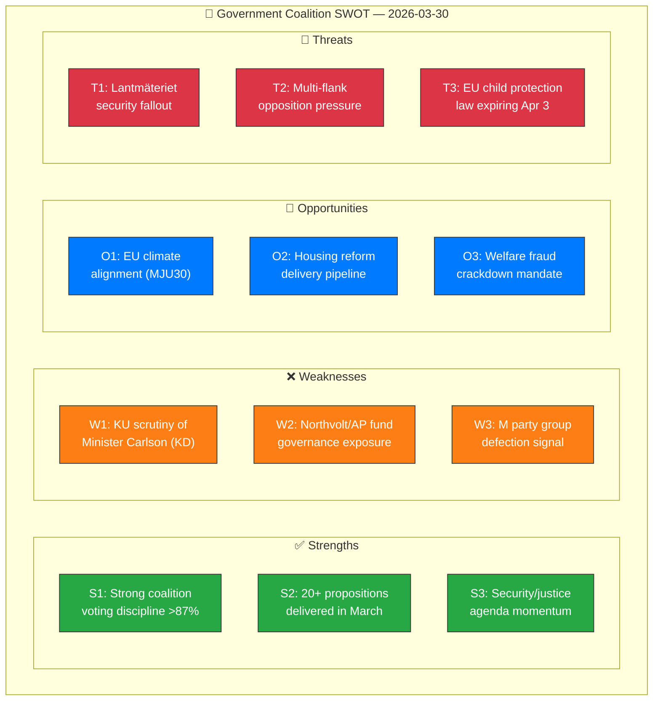

# 💼 Political SWOT Analysis — 2026-03-30

**📋 Document Owner:** CEO | **📄 Version:** 1.0 | **📅 Last Updated:** 2026-03-30 (UTC)
**🏢 Owner:** Hack23 AB (Org.nr 5595347807) | **🏷️ Classification:** Public

---

## 📋 SWOT Context

| Field | Value |
|-------|-------|
| **SWOT ID** | `SWT-2026-03-30-001` |
| **Analysis Date** | `2026-03-30 10:33 UTC` |
| **Analysis Scope** | Government coalition (M, KD, L + SD supply) |
| **Reference Period** | 2026-W14 (2026-03-30) |
| **Produced By** | `news-realtime-monitor` |
| **Primary MCP Sources** | search_dokument, get_betankanden, get_propositioner, search_voteringar |
| **Validity Window** | Valid until 2026-04-06 |

---

## 🏛️ Section 1: Government Coalition SWOT

### ✅ Strengths — Government Coalition

| # | Strength Statement | Evidence (dok_id) | Confidence | Impact | Entry Date |
|---|-------------------|-------------------|:----------:|:------:|:----------:|
| S1 | Coalition maintains Riksdag majority through SD supply-and-confidence agreement; voting discipline remains strong (cross-party alignment >87% between M-KD-L per voteringar data) | search_voteringar AU10 | `H` | `H` | 2026-03-30 |
| S2 | Active legislative agenda — 20+ government propositions delivered in March 2026 (criminal justice, housing, food security, welfare reform) | HD03227, HD03221, HD03210, HD03213 | `H` | `H` | 2026-03-30 |
| S3 | Strong performance on security and justice agenda — props on youth crime investigation (HD03227), honour-based violence (HD03213), security protection (HD01JuU29) | HD03227, HD03213, HD01JuU29 | `H` | `M` | 2026-03-30 |

### ❌ Weaknesses — Government Coalition

| # | Weakness Statement | Evidence (dok_id) | Confidence | Impact | Entry Date |
|---|-------------------|-------------------|:----------:|:------:|:----------:|
| W1 | KU scrutiny hearings on Lantmäteriet security breaches expose infrastructure and bostadsminister Carlson (KD) to accountability questioning | HDC220260330ou1, HDA7KU38 | `H` | `M` | 2026-03-30 |
| W2 | Northvolt/AP fund investigation implicates previous government decisions but may extend to current government's handling of state investment governance | HDC220260330ou2 | `M` | `H` | 2026-03-30 |
| W3 | MP Marléne Lund Kopparklint leaves M party group — signals potential internal party friction ahead of 2026 election | HD0I100 (agenda item 2) | `H` | `M` | 2026-03-30 |

### 🔵 Opportunities — Government Coalition

| # | Opportunity Statement | Evidence (dok_id) | Confidence | Impact | Entry Date |
|---|----------------------|-------------------|:----------:|:------:|:----------:|
| O1 | Climate goals committee report (MJU30) allows government to demonstrate EU alignment while maintaining pragmatic economic policy | HD01MJU30 | `M` | `M` | 2026-03-30 |
| O2 | Strong legislative pipeline on housing reform (HD03187, HD03188, HD03212) positions coalition as delivering on cost-of-living concerns | HD03187, HD03188, HD03212 | `H` | `H` | 2026-03-30 |
| O3 | Welfare fraud crackdown (HD03210 bidragsspärr, HD03161 felaktiga utbetalningar) aligns with voter priorities | HD03210, HD03161 | `H` | `M` | 2026-03-30 |

### 🔴 Threats — Government Coalition

| # | Threat Statement | Evidence (dok_id) | Confidence | Impact | Entry Date |
|---|-----------------|-------------------|:----------:|:------:|:----------:|
| T1 | KU findings on Lantmäteriet security breaches could escalate if ministerial negligence is established; affects government credibility on national security | HDC220260330ou1 | `M` | `H` | 2026-03-30 |
| T2 | Multiple opposition written questions on diverse policy areas (migration, Palestine, LKAB) maintain sustained pressure across flanks | HD11662, HD11663, HD11661 | `H` | `M` | 2026-03-30 |
| T3 | EU child protection regulation expires April 3 (HD11664) — government response under scrutiny from S | HD11664 | `M` | `M` | 2026-03-30 |

---

## 📊 SWOT Quadrant Mapping

---

## 📌 Strategic Implications

### Key Watch Items

1. **KU hearing outcomes** — Monitor for formal criticism or ministerial censure recommendations from today's hearings (dok_id: HDC220260330ou1, HDC220260330ou2)
2. **M party stability** — Track whether Lund Kopparklint's departure triggers further defections or internal discipline measures
3. **Climate policy debate** — MJU30 report will likely trigger plenary debate this week; watch for coalition-opposition dynamics on EU alignment
4. **EU child protection gap** — Deadline April 3 creates urgency; government response before Easter recess is critical

---

## 📋 Document Control

| Field | Value |
|-------|-------|
| **Classification** | Public |
| **Retention** | 90 days |
| **Next Update** | 2026-03-30 evening SWOT update |
