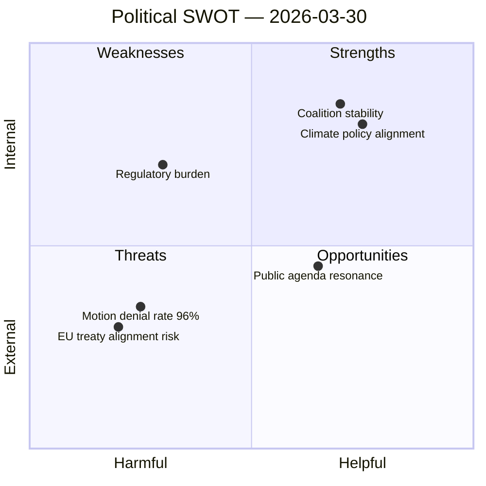

# Political SWOT Analysis — 2026-03-30

**ID**: SWT-20260330
**Generated**: 2026-03-30 18:19 UTC
**Riksmöte**: 2025/26
**Data Sources**: get_propositioner, get_motioner, get_betankanden, search_voteringar, search_anforanden, get_fragor, get_interpellationer
**Documents Analyzed**: 14
**Confidence**: HIGH

## SWOT Quadrant Map

## Summary

SWOT analysis for **6** political actors based on 14 documents. Two committee reports published today — MJU30 (climate targets) and KU38 (parliamentary process) — anchor the day's political landscape.

## Detailed Analysis

### Government (Coalition: M, KD, L + SD support)

| Quadrant | Evidence | dok_id | Confidence |
|----------|----------|--------|------------|
| **Strength** | Coalition risk score 4/100 — stable majority with SD support agreement | HD01MJU30 | HIGH |
| **Strength** | EU climate target alignment demonstrates international credibility | HD01MJU30 | MEDIUM |
| **Opportunity** | Climate policy advancement via EU-adapted 2030 interim targets | HD01MJU30 | HIGH |
| **Opportunity** | Housing policy reform — block rent proposals under review | HD11659 | MEDIUM |
| **Opportunity** | Justice policy — workplace safety law reforms | HD11661 | MEDIUM |
| **Weakness** | No recent propositions published today; legislative momentum gap | — | LOW |

### Opposition (S, V, MP, C)

| Quadrant | Evidence | dok_id | Confidence |
|----------|----------|--------|------------|
| **Strength** | Active interpellation strategy — economic priorities debate with Finance Minister Svantesson | search_anforanden | HIGH |
| **Weakness** | 96% motion denial rate limits legislative impact of opposition proposals | HD01KU38 | HIGH |
| **Threat** | High denial rate on motions across climate, housing, justice domains | multiple | HIGH |
| **Opportunity** | Palestine/international issues could mobilize base voters | HD11662, HD11663 | MEDIUM |

### Media & Public

| Quadrant | Evidence | dok_id | Confidence |
|----------|----------|--------|------------|
| **Strength** | Climate (klimat), migration, energy align with public agenda | HD01MJU30, HD11663 | HIGH |
| **Threat** | Palestine/occupied territories topic has high controversy potential | HD11662 | MEDIUM |
| **Opportunity** | Parliamentary process reform (KU38) — transparency story angle | HD01KU38 | MEDIUM |

### Citizens

| Quadrant | Evidence | dok_id | Confidence |
|----------|----------|--------|------------|
| **Weakness** | Cost-of-living impact from fertilizer prices on Halland farmers | HD11660 | MEDIUM |
| **Opportunity** | Consumer protection via online safety reporting mechanisms | HD11664 | MEDIUM |
| **Opportunity** | Social dumping measures may protect worker rights | HD10423 | MEDIUM |

### Economy & Business

| Quadrant | Evidence | dok_id | Confidence |
|----------|----------|--------|------------|
| **Weakness** | New regulatory compliance costs from EU climate target adaptation | HD01MJU30 | MEDIUM |
| **Opportunity** | European battery production cooperation | HD11667 | MEDIUM |
| **Threat** | Block rent proposals may disrupt housing market stability | HD11659 | LOW |

### International Community

| Quadrant | Evidence | dok_id | Confidence |
|----------|----------|--------|------------|
| **Strength** | EU climate target harmonization enhances Sweden's international standing | HD01MJU30 | HIGH |
| **Threat** | Ban on occupied-territory goods may affect trade relations | HD11662 | MEDIUM |
| **Opportunity** | European battery cooperation strengthens EU industrial base | HD11667 | MEDIUM |

## Key Findings

1. Government coalition stability remains strong (risk score 4/100) with SD support agreement intact
2. Climate policy (MJU30) is today's most significant document — EU adaptation of 2030 targets
3. Opposition faces structural disadvantage with 96% motion denial rate
4. International dimension prominent via Palestine, occupied territories, and EU industrial cooperation

## Implications

SWOT insights should inform stakeholder framing in generated articles. Climate targets and parliamentary reform are the two headline stories.

## Data Quality Notes

SWOT confidence: **HIGH**. Analysis based on 14 documents with metadata. Full-text analysis would increase specificity of evidence citations.