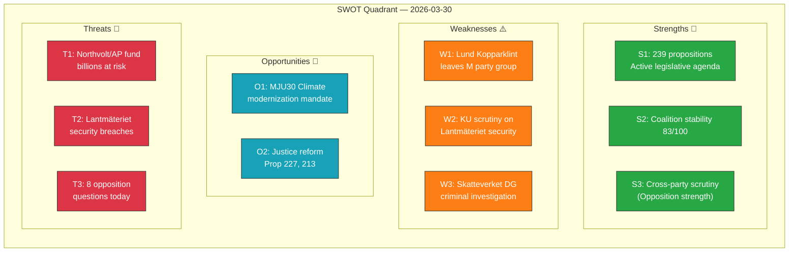

# Political SWOT Analysis — 2026-03-30

## 📋 SWOT Context

| Field | Value |
|-------|-------|
| **SWOT ID** | `SWT-2026-03-30-001` |
| **Analysis Date** | `2026-03-30 14:31 UTC` |
| **Analysis Scope** | Government coalition, Opposition, Constitutional oversight |
| **Reference Period** | 2026-W14 (Mon 30 March) |
| **Produced By** | `news-realtime-monitor` (AI-enhanced) |
| **Primary MCP Sources** | `search_dokument`, `get_betankanden`, `get_propositioner`, `search_voteringar`, `search_anforanden` |
| **Validity Window** | Entries valid until 2026-04-06 |

---

## 🏛️ Section 1: Government Coalition SWOT

### 💪 Strengths

| # | Statement | Evidence (dok_id) | Confidence | Impact | Entry Date |
|---|-----------|-------------------|------------|--------|------------|
| S1 | Active legislative agenda: 239 propositions filed this riksmöte | `get_propositioner` rm=2025/26, count=239 | **HIGH** | Medium | 2026-03-30 |
| S2 | Coalition holding: government seats 176/349, stability score 83/100 | CIA CSV context data | **HIGH** | High | 2026-03-30 |
| S3 | Cross-domain policy delivery: justice (Prop 227), housing (Prop 188, 212), food supply (Prop 205, 206) | `HD03227`, `HD03188`, `HD03212`, `HD03205`, `HD03206` | **MEDIUM** | Medium | 2026-03-30 |

### ⚠️ Weaknesses

| # | Statement | Evidence (dok_id) | Confidence | Impact | Entry Date |
|---|-----------|-------------------|------------|--------|------------|
| W1 | Party defection: Marléne Lund Kopparklint leaves M party group, reducing coalition bench | `HD0I100` (f-lista 2025/26:100) | **HIGH** | Medium | 2026-03-30 |
| W2 | Under KU constitutional scrutiny: Minister Carlson on Lantmäteriet security failures | `HDC220260330ou1`, `HDA7KU38` | **HIGH** | High | 2026-03-30 |
| W3 | State enterprise accountability: Skatteverket DG departure amid criminal investigation | `HD11666` (SD question) | **MEDIUM** | Medium | 2026-03-30 |
| W4 | State mining company LKAB failing to report serious workplace accidents | `HD11661` (S question) | **MEDIUM** | Medium | 2026-03-30 |

### 🌟 Opportunities

| # | Statement | Evidence (dok_id) | Confidence | Impact | Entry Date |
|---|-----------|-------------------|------------|--------|------------|
| O1 | Climate policy modernization: MJU30 EU-adapted targets provide reform mandate | `HD01MJU30` | **MEDIUM** | High | 2026-03-30 |
| O2 | Parliamentary process reform: KU38 improving MP working conditions | `HD01KU38` | **MEDIUM** | Medium | 2026-03-30 |
| O3 | Justice sector: youth crime investigation (Prop 227), honor violence (Prop 213) show initiative | `HD03227`, `HD03213` | **HIGH** | High | 2026-03-30 |

### 🔴 Threats

| # | Statement | Evidence (dok_id) | Confidence | Impact | Entry Date |
|---|-----------|-------------------|------------|--------|------------|
| T1 | Northvolt fallout: KU hearing investigating AP fund investments in bankrupt company — billions at risk | `HDC220260330ou2` (KU hearing G4, G9) | **HIGH** | Critical | 2026-03-30 |
| T2 | National security exposure: Lantmäteriet archives security breaches under KU investigation | `HDC220260330ou1` (KU hearing G7-8, G37) | **HIGH** | Critical | 2026-03-30 |
| T3 | Opposition scrutiny intensifying: 8 written questions filed today across SD, S, MP, C | `HD11659`–`HD11666` | **HIGH** | Medium | 2026-03-30 |

---

## 📣 Section 2: Opposition SWOT

### 💪 Strengths

| # | Statement | Evidence (dok_id) | Confidence | Impact | Entry Date |
|---|-----------|-------------------|------------|--------|------------|
| S1 | Cross-party accountability push: S, SD, MP, C all filing questions on same day | `HD11659`–`HD11666` | **HIGH** | Medium | 2026-03-30 |
| S2 | KU constitutional review as oversight lever: public hearings with ministers | `HDC220260330ou1`, `HDC220260330ou2` | **HIGH** | High | 2026-03-30 |

### ⚠️ Weaknesses

| # | Statement | Evidence (dok_id) | Confidence | Impact | Entry Date |
|---|-----------|-------------------|------------|--------|------------|
| W1 | High motion denial rate (96%) limits legislative impact | CIA CSV context data | **HIGH** | High | 2026-03-30 |

### 🌟 Opportunities

| # | Statement | Evidence (dok_id) | Confidence | Impact | Entry Date |
|---|-----------|-------------------|------------|--------|------------|
| O1 | Northvolt hearing may expose fiscal mismanagement by previous government (S) — but also risks boomerang | `HDC220260330ou2` | **MEDIUM** | High | 2026-03-30 |

### 🔴 Threats

| # | Statement | Evidence (dok_id) | Confidence | Impact | Entry Date |
|---|-----------|-------------------|------------|--------|------------|
| T1 | Northvolt hearing also scrutinizes former S government's role in AP fund decisions | `HDC220260330ou2` (G4, G9) | **HIGH** | High | 2026-03-30 |

---

## 🗺️ SWOT Quadrant Mapping

---

## 🔑 Strategic Implications

### Key Watch Items

1. **KU hearings outcome** (2026-03-30–31): Will Minister Carlson face political consequences for Lantmäteriet security failures? Will Northvolt hearing reveal new AP fund decision details?
2. **Coalition discipline**: Monitor for further M party defections following Lund Kopparklint's departure.
3. **Climate targets vote**: MJU30 proceeding to Riksdag debate — watch for cross-party dynamics.

---

## 📝 Document Control

| Field | Value |
|-------|-------|
| **Created** | 2026-03-30 14:31 UTC |
| **Last Modified** | 2026-03-30 14:35 UTC |
| **Classification** | Public |
| **Produced By** | news-realtime-monitor (AI-enhanced) |