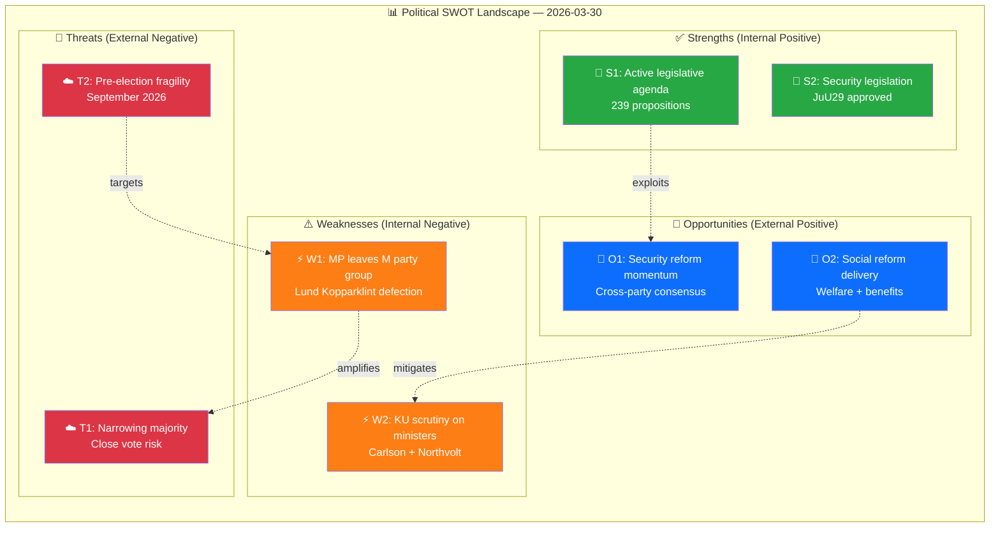

# 💼 Political SWOT Analysis — 2026-03-30

## 📋 SWOT Context

| Field | Value |
|-------|-------|
| **SWOT ID** | `SWT-2026-03-30-001` |
| **Analysis Date** | `2026-03-30 01:14 UTC` |
| **Analysis Scope** | Government coalition (M, KD, L + SD support) |
| **Reference Period** | 2026-W13 (March 24–30) |
| **Produced By** | news-realtime-monitor |
| **Primary MCP Sources** | search_dokument, get_propositioner, get_betankanden, search_voteringar, search_anforanden |
| **Validity Window** | Entries valid until 2026-04-06 |

---

## 🏛️ Section 1: Government Coalition SWOT

### ✅ Strengths — Government Coalition

| # | Strength Statement | Evidence (dok_id) | Confidence | Impact | Entry Date |
|---|-------------------|-------------------|:----------:|:------:|:----------:|
| S1 | Active legislative agenda: 239 propositions tabled in 2025/26 session covering criminal justice, social reform, defense | HD03227, HD03213, HD03210, HD03162 | H | H | 2026-03-30 |
| S2 | JuU29 security protection for real estate approved by committee — demonstrates cross-party security consensus | HD01JuU29 | H | M | 2026-03-30 |
| S3 | Multiple criminal justice reforms advancing: youth crime investigation (Prop 227), honour violence (Prop 213), benefit fraud sanctions (Prop 210) | HD03227, HD03213, HD03210 | H | H | 2026-03-30 |

**Coalition Strength Summary:** The government maintains a strong legislative delivery record with 239 propositions this session, particularly in criminal justice and national security — core coalition priorities.

---

### ⚠️ Weaknesses — Government Coalition

| # | Weakness Statement | Evidence (dok_id) | Confidence | Impact | Entry Date |
|---|-------------------|-------------------|:----------:|:------:|:----------:|
| W1 | MP Marléne Lund Kopparklint formally leaves M party group — reduces governing bloc representation | HD0I100 (f-lista 2025/26:100) | H | H | 2026-03-30 |
| W2 | KU constitutional scrutiny: Minister Carlson questioned on Lantmäteriet security archive failures — governance weakness exposed | HDC220260330ou1, HDA7KU38 | H | M | 2026-03-30 |
| W3 | Northvolt/AP-fund investment scrutiny: former government actors (Ulf Holm) questioned on state financial governance | HDC220260330ou2 | M | M | 2026-03-30 |

**Coalition Weakness Summary:** The M party loses an MP from its parliamentary group on the same day KU conducts high-profile hearings on ministerial accountability — a politically damaging convergence.

---

### 🚀 Opportunities — Government Coalition

| # | Opportunity Statement | Evidence (dok_id) | Confidence | Impact | Entry Date |
|---|----------------------|-------------------|:----------:|:------:|:----------:|
| O1 | Security legislation momentum: JuU29 security protection + Prop 178 (FOI rules) + Prop 162 (Ukraine support) builds credible security narrative | HD01JuU29, HD03178, HD03162 | H | H | 2026-03-30 |
| O2 | Social reform agenda: reformed income support (Prop 201) + benefit sanctions (Prop 210) appeals to voter base ahead of 2026 election | HD03201, HD03210 | M | M | 2026-03-30 |

**Coalition Opportunity Summary:** The government can leverage its security and social reform legislative programme to offset reputational damage from KU hearings and the MP defection.

---

### 🔴 Threats — Government Coalition

| # | Threat Statement | Evidence (dok_id) | Confidence | Impact | Entry Date |
|---|-----------------|-------------------|:----------:|:------:|:----------:|
| T1 | MP defection from M narrows coalition's Riksdag margin — future close votes become riskier | HD0I100 | H | H | 2026-03-30 |
| T2 | KU hearing outcomes may produce formal constitutional criticism of sitting minister (Carlson, KD) | HDC220260330ou1, HDA7KU38 | M | H | 2026-03-30 |
| T3 | Pre-election fragility: September 2026 election approaching; internal M cohesion under pressure | HD0I100 | M | H | 2026-03-30 |

**Coalition Threat Summary:** The convergence of an MP leaving M and constitutional scrutiny of ministers creates elevated electoral vulnerability 6 months before the general election.

---

## 🏛️ Section 2: Main Opposition SWOT

**Opposition Subject:** Social Democrats (S) + V + MP bloc

### ✅ Strengths — Opposition

| # | Strength Statement | Evidence (dok_id) | Confidence | Impact | Entry Date |
|---|-------------------|-------------------|:----------:|:------:|:----------:|
| S1 | KU hearings provide constitutional platform to challenge government on Northvolt investment failures and Lantmäteriet security | HDC220260330ou1, HDC220260330ou2 | H | H | 2026-03-30 |
| S2 | M party defection signals governing party internal weakness that opposition can exploit electorally | HD0I100 | H | M | 2026-03-30 |

### ⚠️ Weaknesses — Opposition

| # | Weakness Statement | Evidence (dok_id) | Confidence | Impact | Entry Date |
|---|-------------------|-------------------|:----------:|:------:|:----------:|
| W1 | S-led previous government also under scrutiny in KU (Northvolt AP-fund investments happened under S government) | HDC220260330ou2 | H | M | 2026-03-30 |

### 🚀 Opportunities — Opposition

| # | Opportunity Statement | Evidence (dok_id) | Confidence | Impact | Entry Date |
|---|----------------------|-------------------|:----------:|:------:|:----------:|
| O1 | Narrowing government majority creates legislative leverage for opposition influence on key votes | HD0I100 | H | H | 2026-03-30 |

### 🔴 Threats — Opposition

| # | Threat Statement | Evidence (dok_id) | Confidence | Impact | Entry Date |
|---|-----------------|-------------------|:----------:|:------:|:----------:|
| T1 | Northvolt KU hearing exposes S-era government decisions, potentially deflecting blame back to opposition | HDC220260330ou2 | M | M | 2026-03-30 |

---

## 🏛️ Section 3: Policy Domain SWOT

**Policy Domain:** National Security & Constitutional Accountability (SEC/GOV)

### ✅ Strengths in Domain

| # | Strength Statement | Evidence (dok_id) | Confidence | Impact | Entry Date |
|---|-------------------|-------------------|:----------:|:------:|:----------:|
| S1 | JuU29 strengthens security protection for real estate transactions with national security implications — bipartisan support | HD01JuU29 | H | H | 2026-03-30 |

### ⚠️ Weaknesses in Domain

| # | Weakness Statement | Evidence (dok_id) | Confidence | Impact | Entry Date |
|---|-------------------|-------------------|:----------:|:------:|:----------:|
| W1 | Lantmäteriet archive security breaches revealed systemic weakness in national infrastructure protection | HDC220260330ou1 | H | H | 2026-03-30 |

### 🚀 Opportunities in Domain

| # | Opportunity Statement | Evidence (dok_id) | Confidence | Impact | Entry Date |
|---|----------------------|-------------------|:----------:|:------:|:----------:|
| O1 | KU hearings functioning as accountability mechanism — strengthens democratic oversight norms | HDA3KU39 | H | M | 2026-03-30 |

### 🔴 Threats to Domain

| # | Threat Statement | Evidence (dok_id) | Confidence | Impact | Entry Date |
|---|-----------------|-------------------|:----------:|:------:|:----------:|
| T1 | If KU criticism does not lead to accountability actions, it may erode public trust in constitutional oversight | HDC220260330ou1 | M | M | 2026-03-30 |

---

## 📊 SWOT Quadrant Mapping

### Visual SWOT Impact Diagram

---

## 🔑 Strategic Implications

The March 30 convergence of MP defection and constitutional scrutiny represents the most politically turbulent day for the Tidö coalition this month. Lund Kopparklint's departure from M directly weakens the government's parliamentary arithmetic, while KU hearings on Lantmäteriet security (Carlson) and Northvolt investment governance (Holm) expose policy failures under both current and previous governments. The critical interaction is W1↔T1: each additional MP defection compounds electoral vulnerability as Sweden approaches the September 2026 general election.

**Key Watch Items:**
1. Whether Lund Kopparklint joins another party group or remains independent — affects vote calculations
2. KU hearing formal findings on Carlson — potential ministerial confidence implications
3. March 31 Riksdag votes (JuU29 security protection, UbU10 education) — first test of narrowed majority

---

**Document Control:**
- **Template Path:** `/analysis/templates/swot-analysis.md`
- **Framework Reference:** [SWOT.md](../../SWOT.md), [methodologies/political-swot-framework.md](../methodologies/political-swot-framework.md)
- **Classification:** Public
- **Next Review:** 2026-06-26