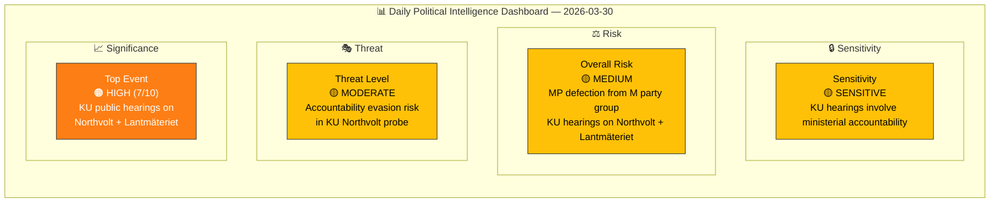
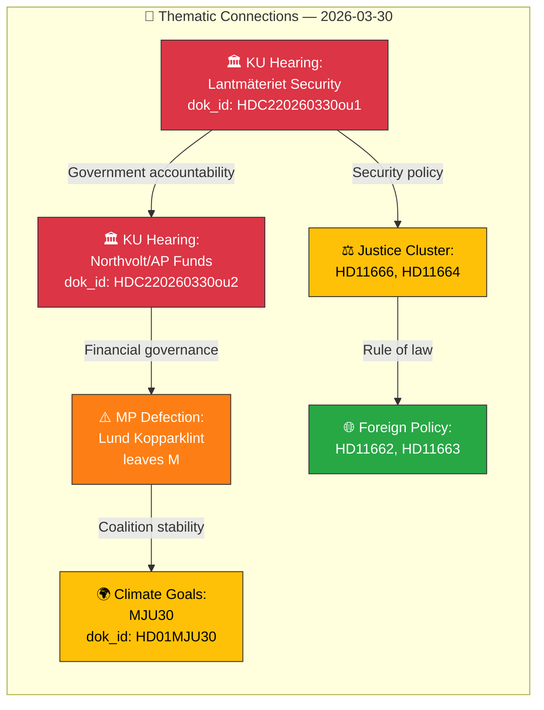

# 🧩 Political Intelligence Synthesis — 2026-03-30

**📋 Document Owner:** CEO | **📄 Version:** 1.0 | **📅 Last Updated:** 2026-03-30 (UTC)
**🏢 Owner:** Hack23 AB (Org.nr 5595347807) | **🏷️ Classification:** Public

---

## 📋 Synthesis Context

| Field | Value |
|-------|-------|
| **Synthesis ID** | `SYN-2026-03-30-001` |
| **Analysis Date** | `2026-03-30 10:33 UTC` |
| **Documents Analyzed** | 10 parliamentary documents + 2 KU hearing agendas |
| **Analysis Period** | 2026-03-29 00:00 – 2026-03-30 12:00 UTC |
| **Produced By** | `news-realtime-monitor` agentic workflow |
| **Overall Confidence** | **MEDIUM** |

---

## 📊 Intelligence Dashboard

### Daily Political Landscape

---

## 🏛️ Section 1: Top Events Ranked by Significance

| Rank | Event | dok_id | Score | Tier | Rationale | Confidence |
|:----:|-------|--------|:-----:|:----:|-----------|:----------:|
| 1 | KU public hearing: Minister Carlson (KD) on Lantmäteriet security breaches | HDC220260330ou1, HDA7KU38 | **7/10** | 🟠 HIGH | Minister accountability + national security policy (+2 security, +1 named minister, +2 multi-party KU) | `[HIGH]` |
| 2 | KU public hearing: Former State Secretary Ulf Holm on Northvolt/AP funds | HDC220260330ou2 | **7/10** | 🟠 HIGH | Billion-SEK state investment scandal, AP fund governance (+2 fiscal, +2 multi-party KU, +1 named official) | `[HIGH]` |
| 3 | MP Marléne Lund Kopparklint leaves Moderaterna party group | HD0I100 | **5/10** | 🟡 MEDIUM | Party defection affects coalition arithmetic; M loses one seat in party group | `[HIGH]` |
| 4 | Committee report: Sweden's Climate Goals — EU-adapted 2030 targets | HD01MJU30 | **5/10** | 🟡 MEDIUM | Climate policy direction, EU alignment, environmental committee position | `[MEDIUM]` |
| 5 | Committee report: Parliamentary process reform (KU38) | HD01KU38 | **4/10** | 🟡 MEDIUM | Constitutional reform of parliamentary procedures | `[MEDIUM]` |
| 6 | Written question: Director-generals under criminal investigation (SD) | HD11666 | **4/10** | 🟡 MEDIUM | Skatteverket leadership accountability, justice policy | `[MEDIUM]` |
| 7 | Written question: Child abuse detection online — EU law expiring Apr 3 | HD11664 | **4/10** | 🟡 MEDIUM | Time-sensitive EU regulation affecting child protection | `[MEDIUM]` |
| 8 | Written question: Ban goods from occupied Palestine | HD11662 | **3/10** | 🟢 LOW | Foreign policy, trade sanctions — follows EU-wide trend | `[MEDIUM]` |
| 9 | Written question: LKAB workplace safety violations | HD11661 | **3/10** | 🟢 LOW | State-owned enterprise accountability | `[MEDIUM]` |
| 10 | Written question: Stateless Palestinians from Iraq | HD11663 | **3/10** | 🟢 LOW | Migration enforcement gap | `[MEDIUM]` |

---

## 🔗 Section 2: Cross-Document Theme Map

---

## 📌 Section 3: Key Intelligence Findings

1. **[HIGH confidence]** The Constitutional Committee (KU) holds two public hearings today examining government accountability — Minister Carlson (KD) faces questioning on Lantmäteriet security breaches (dok_id: HDC220260330ou1), and former State Secretary Ulf Holm is questioned about the Northvolt/AP fund investment decisions (dok_id: HDC220260330ou2). These hearings are part of KU's annual scrutiny of ministerial conduct.

2. **[HIGH confidence]** MP Marléne Lund Kopparklint has formally left the Moderate party group (dok_id: HD0I100, item 2). This reduces M's parliamentary group size and could signal internal party tensions ahead of the 2026 election campaign period.

3. **[MEDIUM confidence]** The Environmental Committee (MJU) has published its report on Sweden's climate goals (dok_id: HD01MJU30), addressing EU-adapted interim targets for 2030. This positions Sweden's climate policy within the EU framework and may trigger debate on environmental ambition levels.

4. **[MEDIUM confidence]** A cluster of 8 written questions filed today spans justice, migration, foreign policy, housing, and consumer protection domains — indicating broad opposition engagement across policy areas on this Monday sitting day.

---

## 📊 Section 4: Data Quality & Coverage

| Source | Status | Items Found | Coverage |
|--------|:------:|:-----------:|:--------:|
| Riksdagsdokument (search_dokument) | ✅ Live | 30 | Full |
| Voteringar (search_voteringar) | ✅ Live | 20 (latest: 2026-03-04) | Historical |
| Anföranden (search_anforanden) | ✅ Live | 20 | Recent debates |
| Propositioner (get_propositioner) | ✅ Live | 20 | Current session |
| Betänkanden (get_betankanden) | ✅ Live | 20 | Current session |
| Regeringen (search_regering) | ✅ Live | 0 (no weekend publications) | Expected |
| Kalender (get_calendar_events) | ❌ API Error | HTML returned | Known issue |

**Calendar API Note:** The Riksdag calendar API returned HTML instead of JSON (known intermittent issue). Calendar data was supplemented by `search_dokument` results showing scheduled KU meetings (HDA7KU38, HDA3KU39) and chamber agenda (HD0I100).

---

## 📋 Document Control

| Field | Value |
|-------|-------|
| **Classification** | Public |
| **Retention** | 90 days |
| **Next Update** | 2026-03-30 evening analysis cycle |
