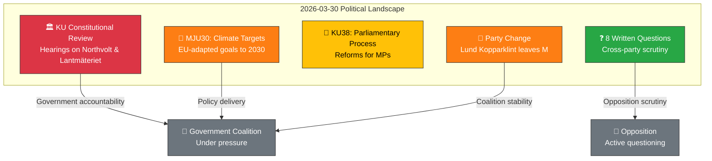

# Analysis Synthesis Summary — 2026-03-30

## 📋 Synthesis Context

| Field | Value |
|-------|-------|
| **Synthesis ID** | `SYN-2026-03-30-001` |
| **Analysis Date** | `2026-03-30 14:31 UTC` |
| **Documents Analyzed** | 14 (pipeline) + 2 KU hearings (direct MCP) |
| **Analysis Period** | 2026-03-29 00:00 – 2026-03-30 14:30 UTC |
| **Produced By** | `news-realtime-monitor` workflow (AI-enhanced) |
| **Overall Confidence** | **MEDIUM** (metadata-only for most documents; KU hearing summaries available) |
| **Primary MCP Sources** | `search_dokument`, `get_betankanden`, `get_propositioner`, `search_voteringar`, `search_anforanden`, `search_regering` |

---

## 📊 Intelligence Dashboard

### Daily Political Landscape

---

## 🔴 HIGH Significance Events

| # | Event | Score | Evidence | Confidence |
|---|-------|-------|----------|------------|
| 1 | **KU Public Hearing: Minister Carlson (KD) on Lantmäteriet security breaches** | **7/10** | dok_id: `HDC220260330ou1`, `HDA7KU38` — KU hearing 14:00 on government handling of security failures at Lantmäteriet archives (G7–8, G37) [HIGH] | **HIGH** |
| 2 | **KU Public Hearing: Ulf Holm on Northvolt/AP fund investments** | **7/10** | dok_id: `HDC220260330ou2` — KU hearing 15:30 investigating former government's role in state AP fund investments in bankrupt Northvolt (G4, G9) [HIGH] | **HIGH** |
| 3 | **MP leaves Moderaterna party group** | **5/10** | dok_id: `HD0I100` — Marléne Lund Kopparklint (M) announced she no longer belongs to M's party group [MEDIUM] | **MEDIUM** |

## 🟡 MEDIUM Significance Events

| # | Event | Score | Evidence | Confidence |
|---|-------|-------|----------|------------|
| 4 | **Climate targets committee report (MJU30)** | **4/10** | dok_id: `HD01MJU30` — EU-adapted climate milestone targets to 2030 [MEDIUM] | **MEDIUM** |
| 5 | **Parliamentary process reform (KU38)** | **4/10** | dok_id: `HD01KU38` — "Den parlamentariska processen med ledamoten i fokus" [MEDIUM] | **MEDIUM** |
| 6 | **Skatteverket DG under criminal investigation** | **4/10** | dok_id: `HD11666` — SD question to Justice Minister on directors general under investigation [MEDIUM] | **MEDIUM** |
| 7 | **LKAB workplace safety violations** | **4/10** | dok_id: `HD11661` — S question on state mining company LKAB failing to report serious accidents [MEDIUM] | **MEDIUM** |

## 🟢 LOW Significance Events

| # | Event | Score | Evidence | Confidence |
|---|-------|-------|----------|------------|
| 8–14 | Written questions on block rent, Palestine, stateless migrants, online child safety, gaming loot boxes, fertilizer prices | 2/10 | dok_ids: `HD11659`–`HD11665` [LOW] | **LOW** |

---

## 🔑 Key Findings

1. **KU constitutional review hearings** are the most significant events today (score 7/10). [HIGH] Two public hearings: Minister Carlson on Lantmäteriet security breaches and former State Secretary Ulf Holm on Northvolt/AP fund investments. These involve government accountability on national security and billions in taxpayer funds.
2. **Party defection**: Marléne Lund Kopparklint (M) leaving the Moderaterna party group signals internal coalition tensions. [MEDIUM]
3. **Climate policy**: MJU30 committee report on EU-adapted climate targets — significant policy direction but routine committee process. [MEDIUM]
4. **No new votes** since 2026-03-04 (AU10). Parliament in recess from floor votes but committees highly active. [HIGH confidence]
5. **Government documents**: Zero new pressmeddelanden or propositioner from Regeringskansliet today (weekend/Monday). [LOW]
6. **Calendar API error**: Riksdagen calendar returned HTML instead of JSON (known intermittent issue). Used `search_dokument` as proxy. [MEDIUM]

---

## 📈 Scoring Formula Applied

| Factor | Points | Applicable Events |
|--------|--------|-------------------|
| Coalition majority at risk | +3 | Party defection (partial) |
| >3 parties involved | +2 | KU hearings (all-party committee) |
| Budget/fiscal implications | +2 | Northvolt/AP fund investments |
| Defense/security policy | +2 | Lantmäteriet security breaches |
| Named minister involved | +1 | Carlson (KD), Holm (former S) |
| Similar topic last 6h | -2 | N/A |

---

## Implications

Overall political risk level: **MEDIUM** (elevated from LOW due to KU constitutional review hearings and party defection). The KU hearings on Northvolt and Lantmäteriet represent significant government accountability events warranting breaking news coverage.

## Data Quality Notes

Overall confidence: **MEDIUM**. Full-text unavailable for most documents (metadata-only from MCP). KU hearing summaries provide good context. Calendar API returned HTML error — used `search_dokument` as fallback.