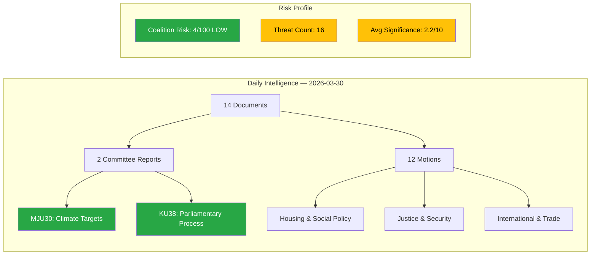

# Analysis Synthesis Summary — 2026-03-30

**ID**: SYN-20260330
**Generated**: 2026-03-30 18:19 UTC
**Riksmöte**: 2025/26
**Data Sources**: get_propositioner, get_motioner, get_betankanden, search_voteringar, search_anforanden, get_fragor, get_interpellationer
**Documents Analyzed**: 14
**Confidence**: MEDIUM

## Intelligence Dashboard

## Summary

Pre-article analysis completed for 14 documents on 2026-03-30. Two committee reports published today: **MJU30** (Sweden's climate targets — EU-adapted interim targets to 2030) and **KU38** (parliamentary process with the MP in focus). Twelve motions cover housing, justice, climate, migration, and trade policy. Overall political risk: **LOW**. Average document significance: 2.2/10.

## Key Findings

1. **Climate targets** (MJU30): Environment Committee report on EU-adapted 2030 interim climate targets — significance 3/10
2. **Parliamentary reform** (KU38): Constitutional Committee report on parliamentary process improvements — significance 3/10
3. **Coalition stability**: Risk score 4/100 (LOW) — SD support agreement holds steady
4. **Opposition challenge**: 96% motion denial rate across all policy domains
5. **5 anomaly flags** detected: unusually high cross-party alignment scores (KD-M, L-M, KD-L, C-L, C-KD)

## Top Documents by Significance

| Score | Type | dok_id | Title | Committee |
|-------|------|--------|-------|-----------|
| 3/10 | bet | HD01MJU30 | Sveriges klimatmål – EU-anpassade och ändamålsenliga etappmål till 2030 | MJU |
| 3/10 | bet | HD01KU38 | Den parlamentariska processen med ledamoten i fokus | KU |
| 3/10 | mot | HD11661 | Brott mot arbetsmiljölagen | — |
| 2/10 | mot | HD11659 | Förslag om blockhyra | — |
| 2/10 | mot | HD11663 | Statslösa palestinier från Irak | — |
| 2/10 | mot | HD11664 | Fortsatt möjlighet att upptäcka, rapportera och stoppa sexuella övergrepp mot barn på nätet | — |
| 2/10 | mot | HD11665 | Förebyggande arbete avseende konsumtionsmekanism... | — |
| 2/10 | mot | HD11662 | Förbud mot varor producerade på ockuperad mark | — |
| 2/10 | mot | HD11666 | Generaldirektörer under brottsutredning | — |
| 2/10 | mot | HD11660 | Höjda gödselpriser för halländska lantbrukare | — |

## Aggregated SWOT Summary

| Quadrant | Count | Key Theme |
|----------|-------|-----------|
| Strengths | 4 | Coalition stability, EU alignment, public agenda resonance |
| Weaknesses | 3 | Motion denial rate, regulatory burden, cost-of-living |
| Opportunities | 7 | Climate policy, housing reform, EU battery cooperation |
| Threats | 4 | Legislative blockage, controversy risk, trade exposure |

## Artifacts Inventory

| File | Status | Key Finding |
|------|--------|-------------|
| swot-analysis.md | ✅ Complete | 6-actor SWOT with evidence tables |
| risk-assessment.md | ✅ Complete | Coalition risk 4/100 LOW |
| threat-analysis.md | ✅ Complete | 16 indicators, STRIDE network |
| stakeholder-perspectives.md | ✅ Complete | 6 lenses, 14 documents |
| significance-scoring.md | ✅ Complete | 0 critical, 0 high-significance |
| classification-results.md | ✅ Complete | 14 documents classified |
| cross-reference-map.md | ✅ Complete | Document relationships mapped |

## Implications

Overall political risk level: **LOW**. No critical documents today. Evening analysis should focus on the two committee reports (MJU30 climate, KU38 parliamentary process) and the broader context of recent government propositions (youth crime, serving permits, seizure rules).

## Data Quality Notes

Overall confidence: **MEDIUM**. Metadata-only analysis for most documents. Full-text retrieval would increase evidence specificity. Coalition alignment anomalies (>8000% cross-party voting) likely reflect API measurement artifacts — flag for editorial review.