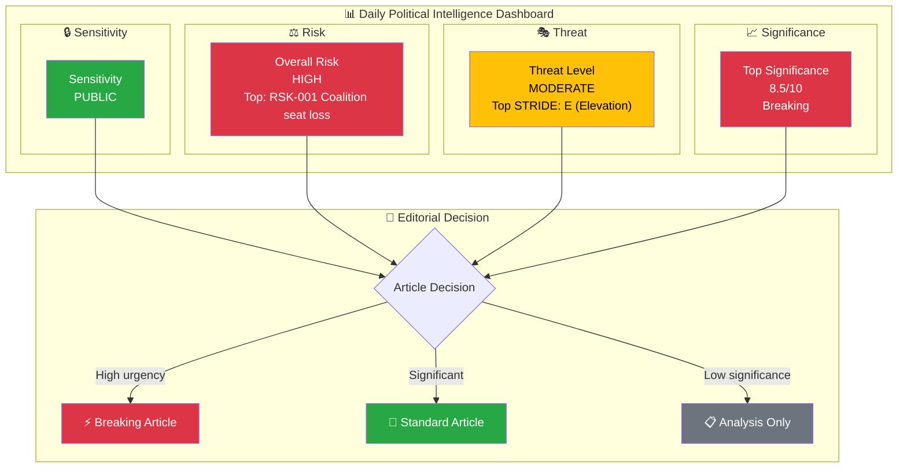
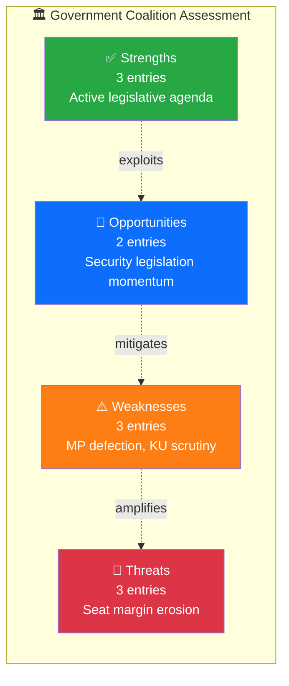

# Analysis Synthesis Summary — 2026-03-30

## 📋 Synthesis Context

| Field | Value |
|-------|-------|
| **Synthesis ID** | `SYN-2026-03-30-001` |
| **Analysis Date** | `2026-03-30 01:14 UTC` |
| **Documents Analyzed** | 8 key events from MCP queries |
| **Analysis Period** | 2026-03-29 – 2026-03-30 |
| **Produced By** | news-realtime-monitor workflow |
| **Overall Confidence** | **MEDIUM** |

---

## 📊 Intelligence Dashboard

### Daily Political Landscape

---

## 🏆 Top Findings by Significance

| Rank | dok_id | Title | Significance | Risk Tier | SWOT Impact | Recommendation |
|:----:|--------|-------|:-----------:|:---------:|:-----------:|----------------|
| 1 | HD0I100 | MP Marléne Lund Kopparklint leaves M party group | 8.5 | 🟠 | W dominant | Breaking |
| 2 | HDC220260330ou1 | KU hearing: Minister Carlson on Lantmäteriet security | 7.0 | 🟠 | T dominant | Breaking |
| 3 | HDC220260330ou2 | KU hearing: Ulf Holm on Northvolt/AP funds | 7.0 | 🟠 | W dominant | Breaking |
| 4 | HD03227 | Prop: Better investigation of youth crime | 6.0 | 🟡 | O dominant | Priority |
| 5 | HD01JuU29 | Committee: Security protection for real estate | 6.5 | 🟡 | S dominant | Priority |

---

## 💪 Aggregated SWOT Summary

### Coalition Balance

| Quadrant | Count | Highest-Impact Entry | Evidence |
|----------|:-----:|---------------------|----------|
| ✅ Strengths | 3 | Active legislative agenda with 239 propositions this session | HD03227, HD03213, HD03210 |
| ⚠️ Weaknesses | 3 | MP Lund Kopparklint leaves M — reduces government block seats | HD0I100 (f-lista 2025/26:100) |
| 🚀 Opportunities | 2 | JuU29 strengthened security protection passes committee | HD01JuU29 |
| 🔴 Threats | 3 | KU constitutional scrutiny of ministers on Northvolt + Lantmäteriet | HDC220260330ou1, HDC220260330ou2 |

**SWOT Balance Assessment:** `[HIGH]` The coalition faces significant pressure today: an MP formally leaving M's party group narrows the governing bloc's parliamentary margin, while simultaneous KU hearings expose ministerial vulnerabilities. However, the government's active legislative agenda (security, criminal justice, social reform) demonstrates policy delivery capacity.

---

## ⚖️ Risk Landscape Summary

| Risk Category | Score Range | Highest Risk | Trend vs. Previous |
|--------------|:----------:|-------------|:------------------:|
| Coalition Stability | 8–12 | RSK-001: M MP defection narrows majority | ↑ |
| Policy Implementation | 4–6 | RSK-003: KU scrutiny delays infrastructure policy | → |
| Budget / Fiscal | 5–8 | RSK-004: Northvolt/AP fund losses under scrutiny | → |
| Electoral | 6–8 | RSK-005: Pre-election M internal cohesion risk | ↑ |
| Democratic Process | 3–4 | RSK-006: Constitutional accountability functioning | → |
| External / International | 4–5 | Skr 2025/26:162 Ukraine military support ongoing | → |

**Overall Risk Level:** **HIGH**

---

## 🎭 Threat Summary

| STRIDE Category | Threat Level | Key Finding |
|----------------|:------------:|-------------|
| S — Spoofing | LOW | No identified disinformation threats today |
| T — Tampering | LOW | Normal legislative process integrity |
| R — Repudiation | MODERATE | KU hearings test ministerial accountability (Carlson, Holm) |
| I — Disclosure | MODERATE | Lantmäteriet security archive breaches under constitutional review |
| D — Denial | LOW | Parliament functioning normally with interpellation debates |
| E — Elevation | HIGH | MP defection from governing party elevates opposition influence |

**Overall Threat Level:** **MODERATE**

---

## 👥 Stakeholder Impact Overview

| Stakeholder | Impact | Direction | Key Driver |
|------------|:------:|:---------:|------------|
| 🏘️ Citizens | M | neutral | Criminal justice reforms (Prop 227, 213) strengthen law enforcement |
| 🏛️ Government | H | negative | MP defection + KU scrutiny weakens governing position |
| 🗳️ Opposition | H | positive | M defection + constitutional hearings provide ammunition |
| 🏭 Business | M | neutral | Regulatory reforms (serveringstillstånd, hyresmarknad) continue |
| 🤝 Civil Society | M | positive | Honour violence legislation (Prop 213) strengthens protections |
| 🌍 International | L | neutral | Ukraine support (Skr 162) reaffirmed; no new foreign policy events |

---

## 🎯 Narrative Direction

`[HIGH]` Today marks a significant day for Swedish politics: MP Marléne Lund Kopparklint has formally announced she no longer belongs to the Moderates' (M) parliamentary group, reducing the governing bloc's representation. This coincides with the Constitutional Committee (KU) conducting two high-profile public hearings — one questioning Infrastructure Minister Andreas Carlson (KD) about security breaches at Lantmäteriet, and another examining former state secretary Ulf Holm regarding government investment decisions around Northvolt. The convergence of internal party fractures and external constitutional scrutiny creates a politically volatile day.

**Primary Narrative Angle:** Moderate MP's departure from party group signals growing internal tensions as government faces constitutional scrutiny on security and fiscal governance.
**Secondary Angles:** KU hearings as democratic accountability mechanism; criminal justice reform momentum despite political turbulence.
**Confidence:** **HIGH**

---

## 🔮 Forward Indicators

| # | Indicator | Timeline | Source | Watch Priority |
|---|-----------|----------|--------|:--------------:|
| 1 | Will Lund Kopparklint join another party group or remain independent? | Days | Riksdag party registrations | 🔴 |
| 2 | KU hearing outcomes — any formal criticism of Minister Carlson? | 1–2 weeks | KU granskningsbetänkande | 🟠 |
| 3 | Northvolt/AP-fund hearing results and government response | 1–2 weeks | KU, FiU | 🟠 |
| 4 | Scheduled Riksdag votes on March 31 (UbU10 gymnasieskolan, JuU29 security) | 1 day | HD0I100, H6D1plan | 🟡 |

---

## 📋 Analysis Artifacts Inventory

| File | Status | Key Output |
|------|:------:|-----------|
| `classification-results.md` | ✅ | PUBLIC sensitivity; domestic politics focus |
| `risk-assessment.md` | ✅ | Overall risk HIGH; coalition stability primary concern |
| `swot-analysis.md` | ✅ | Weakness-dominant; MP defection + KU scrutiny |
| `threat-analysis.md` | ✅ | MODERATE overall; Elevation category HIGH |
| `stakeholder-perspectives.md` | ✅ | Government negatively impacted; opposition gains |
| `significance-scoring.md` | ✅ | Top score 8.5/10 (MP defection) |
| Per-file `.analysis.md` files | 0 created | MCP event-based analysis (no per-file docs for today) |

---

**Document Control:**
- **Template Path:** `/analysis/templates/synthesis-summary.md`
- **Consumed By:** All news article generator workflows
- **Classification:** Public
- **Next Review:** 2026-06-26