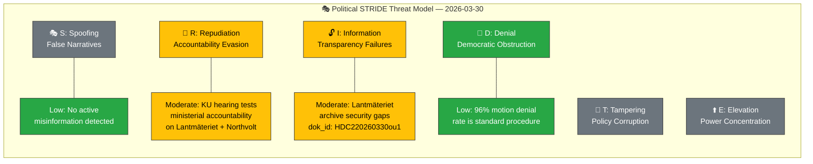

# 🎭 Political Threat Analysis — 2026-03-30

**📋 Document Owner:** CEO | **📄 Version:** 1.0 | **📅 Last Updated:** 2026-03-30 (UTC)
**🏢 Owner:** Hack23 AB (Org.nr 5595347807) | **🏷️ Classification:** Public

---

## 📋 Threat Analysis Context

| Field | Value |
|-------|-------|
| **Threat Analysis ID** | `THR-2026-03-30-001` |
| **Analysis Date** | `2026-03-30 10:33 UTC` |
| **Analysis Period** | 2026-03-30 (daily snapshot) |
| **Produced By** | `news-realtime-monitor` |
| **Political Context** | KU scrutiny hearings on ministerial conduct; one M MP defection; 8 opposition written questions; climate committee report published. |
| **Overall Threat Level** | **MODERATE** |

---

## 🎭 STRIDE-Adapted Threat Inventory

### STRIDE Threat Landscape

### Threat Register

| Threat ID | STRIDE Category | Description | Severity (1-5) | Evidence (dok_id) | Affected Actor | Confidence |
|-----------|:--------------:|-------------|:--------------:|-------------------|---------------|:----------:|
| THR-001 | **R** (Repudiation) | KU hearings test whether Minister Carlson (KD) can be held accountable for Lantmäteriet security failures; risk of evasive testimony | 3 | HDC220260330ou1, HDA7KU38 | Government | `[HIGH]` |
| THR-002 | **R** (Repudiation) | Northvolt/AP fund probe tests accountability for state investment decisions; cross-government responsibility complicates attribution | 3 | HDC220260330ou2 | Government + Opposition (former gov) | `[MEDIUM]` |
| THR-003 | **I** (Information) | Lantmäteriet archive security breaches represent transparency failure in critical national infrastructure data | 3 | HDC220260330ou1 | Citizens | `[HIGH]` |
| THR-004 | **D** (Denial) | High motion denial rate (96%) systematically limits opposition legislative impact; normal but raises democratic quality questions | 2 | search_voteringar data | Opposition | `[HIGH]` |
| THR-005 | **I** (Information) | Migration enforcement gap for stateless Palestinians (HD11663) — lack of transparency on implementation barriers | 2 | HD11663 | Citizens, Migrants | `[MEDIUM]` |

---

## 📌 Key Findings

1. **[HIGH confidence]** The primary threat vector today is **Repudiation** (accountability evasion) — KU's dual hearings directly test ministerial accountability mechanisms. The outcome will signal whether the parliamentary scrutiny system effectively constrains executive power.
2. **[MEDIUM confidence]** **Information Disclosure** threats are elevated due to the Lantmäteriet security breach context — classified national infrastructure data may have been compromised.
3. **[HIGH confidence]** No active **Spoofing** (false narrative) or **Elevation** (power concentration) threats detected in today's parliamentary activity.

---

## 📋 Document Control

| Field | Value |
|-------|-------|
| **Classification** | Public |
| **Retention** | 90 days |
| **Next Update** | 2026-03-30 evening threat update |
