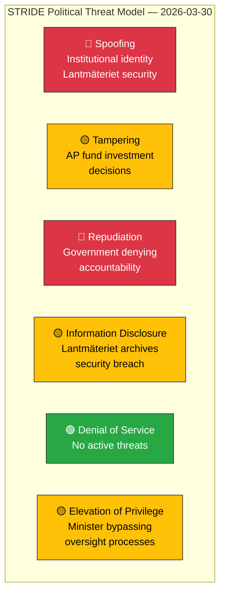

# Political Threat Analysis (STRIDE) — 2026-03-30

## 📋 Threat Context

| Field | Value |
|-------|-------|
| **Assessment ID** | `THR-2026-03-30-001` |
| **Analysis Date** | `2026-03-30 14:35 UTC` |
| **Model** | STRIDE (adapted for political threat analysis) |
| **Documents Analyzed** | 14 + KU hearing events |
| **Produced By** | `news-realtime-monitor` (AI-enhanced) |
| **Confidence** | **MEDIUM** |

---

## 🔴 STRIDE Threat Matrix

---

## 📊 Detailed Threat Assessment

| # | STRIDE | Threat | Severity | Evidence (dok_id) | Confidence | Mitigation |
|---|--------|--------|----------|-------------------|------------|------------|
| T1 | **Information Disclosure** | Lantmäteriet archives security breaches — sensitive geographic/property data exposed | 🔴 HIGH | `HDC220260330ou1`, `HDA7KU38` (G7-8, G37) | **HIGH** | KU hearing mandating accountability |
| T2 | **Tampering** | State AP fund investment decisions in Northvolt — improper influence on public pension funds | 🟡 MEDIUM | `HDC220260330ou2` (G4, G9) | **HIGH** | KU hearing investigating former government role |
| T3 | **Repudiation** | Government denying responsibility for security failures / investment losses | 🔴 HIGH | `HDC220260330ou1`, `HDC220260330ou2` | **MEDIUM** | Public KU hearings create accountability record |
| T4 | **Spoofing** | Institutional credibility: Skatteverket DG departure amid criminal probe | 🟡 MEDIUM | `HD11666` | **MEDIUM** | Parliamentary questions demanding answers |
| T5 | **Elevation** | State enterprise LKAB circumventing workplace safety reporting | 🟡 MEDIUM | `HD11661` | **MEDIUM** | S party scrutiny via written question |
| T6 | **Information Disclosure** | Social cohesion: sensitive migration/Palestine topics in public debate | 🟢 LOW | `HD11662`, `HD11663` | **LOW** | Standard parliamentary questioning |

---

## 🔑 Key Findings

1. **6 active threats** identified, 2 HIGH severity (Lantmäteriet security + government accountability denial). [HIGH confidence]
2. **STRIDE focus**: Information Disclosure and Repudiation dominate. [HIGH confidence]
3. **Constitutional oversight** via KU hearings provides primary mitigation mechanism. [HIGH confidence]
4. **Opposition leverage**: 8 written questions amplify threat landscape. [MEDIUM confidence]

---

## 📝 Document Control

| Field | Value |
|-------|-------|
| **Created** | 2026-03-30 14:31 UTC |
| **Last Modified** | 2026-03-30 14:35 UTC |
| **Classification** | Public |
