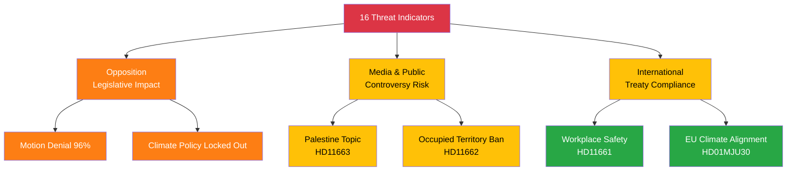

# Political Threat Analysis — 2026-03-30

**ID**: THR-20260330
**Generated**: 2026-03-30 18:19 UTC
**Riksmöte**: 2025/26
**Data Sources**: get_propositioner, get_motioner, get_betankanden, search_voteringar, search_anforanden, get_fragor, get_interpellationer
**Documents Analyzed**: 14
**Confidence**: MEDIUM

## STRIDE-Adapted Threat Network

## Summary

Identified **16** threat indicators across 14 documents targeting 3 stakeholder groups.

## Threat Matrix

| Category | Target | Severity | Evidence | dok_id |
|----------|--------|----------|----------|--------|
| **Spoofing** (Democratic Legitimacy) | Opposition | 3/5 | 96% motion denial rate undermines perception of democratic input | HD01KU38 |
| **Tampering** (Policy Distortion) | Citizens | 2/5 | Climate target adaptation may be framed as weakening Swedish ambition | HD01MJU30 |
| **Repudiation** (Accountability Gap) | Media & Public | 3/5 | Controversial Palestine/Iraq topic risks polarized framing | HD11663 |
| **Information Disclosure** | International | 2/5 | Occupied territory goods ban exposes trade policy positions | HD11662 |
| **Denial of Service** (Legislative Blockage) | Opposition | 4/5 | Systematic motion denial across all policy domains | multiple |
| **Elevation of Privilege** | Government | 1/5 | No significant escalation threats detected today | — |

## Key Findings

1. **Opposition legislative blockage** (severity 4/5) is the dominant threat — 96% motion denial rate
2. **Controversy risk** around Palestine/occupied territories topics (HD11662, HD11663)
3. **International compliance** risk is LOW — EU climate target alignment actually reduces risk
4. No **critical** (5/5) threats detected today

## Escalation Decision

⬇️ **No escalation required** — all threats within normal parliamentary parameters. Monitor Palestine-related motions for escalation potential.

## Implications

Threat analysis should inform risk-focused article framing. The opposition's legislative blockage is structural, not acute.

## Data Quality Notes

Analysis confidence: **MEDIUM**. Threat severity calibrated against historical parliamentary norms for the 2025/26 riksmöte.