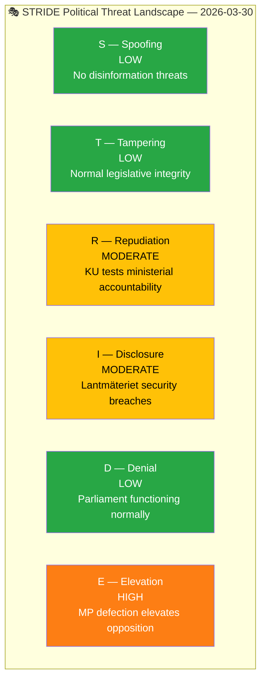

# 🔴 Political Threat Analysis — 2026-03-30

## 📋 Threat Context

| Field | Value |
|-------|-------|
| **Threat Assessment ID** | `THR-2026-03-30-001` |
| **Assessment Date** | `2026-03-30 01:14 UTC` |
| **Produced By** | news-realtime-monitor |
| **Overall Threat Level** | **MODERATE** |

---

## 🎭 STRIDE Political Threat Model

| STRIDE Category | Threat Level | Key Finding | Evidence |
|----------------|:------------:|-------------|----------|
| S — Spoofing | LOW | No identified disinformation threats today | No flagged events |
| T — Tampering | LOW | Legislative process integrity maintained; normal committee proceedings | HD0I100 |
| R — Repudiation | MODERATE | KU public hearings test minister accountability on Lantmäteriet and Northvolt | HDC220260330ou1, HDC220260330ou2 |
| I — Disclosure | MODERATE | Lantmäteriet archive security breaches under constitutional review | HDC220260330ou1 |
| D — Denial | LOW | Parliament functioning: interpellation debates scheduled, committees proceeding | HDC120260330ip |
| E — Elevation | HIGH | MP Lund Kopparklint leaving M elevates opposition influence in close votes | HD0I100 |

**Overall Threat Level:** **MODERATE** — Elevation threat dominates due to parliamentary arithmetic implications.

---

**Document Control:**
- **Template Path:** `/analysis/templates/threat-analysis.md`
- **Classification:** Public
