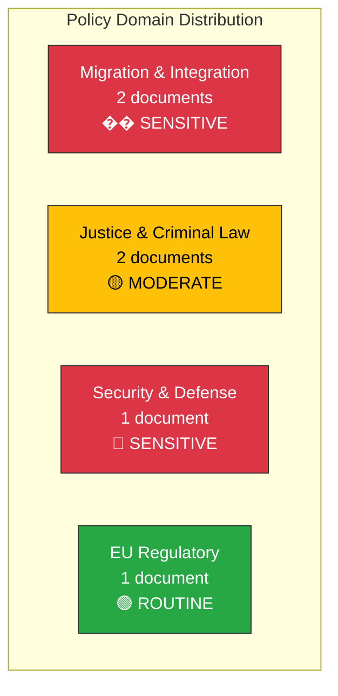

# Political Classification Results — 2026-03-31

**Generated**: 2026-03-31 14:34 UTC
**Data Sources**: riksdag-regering-mcp
**Documents Analyzed**: 6
**Confidence**: HIGH

---

## Summary

Six documents classified by policy domain, sensitivity level, and political urgency. Migration policy dominates (2 of 6 documents), followed by justice/criminal law (2), security/defense (1), and EU regulatory (1).

---

## Classification Overview

---

## Batch Classification Table

| dok_id | Title | Domain | Sensitivity | Urgency | Party Alignment |
|--------|-------|--------|:-----------:|:-------:|:---------------:|
| HD03229 | En ny mottagandelag | Migration | 🔴 SENSITIVE | 🟠 URGENT | M+KD+L+SD vs S+V+MP |
| HD03215 | Tidsbegränsat boende | Migration | 🔴 SENSITIVE | 🟠 URGENT | M+KD+L+SD vs S+V+MP |
| HD03222 | Ersättningsregler brottsoffret | Criminal Justice | 🟡 MODERATE | 🟡 STANDARD | Broad support expected |
| HD03223 | En ny konsumentkreditlag | Consumer | 🟢 ROUTINE | 🟡 STANDARD | Cross-party potential |
| HD01UU6 | Säkerhetspolitik | Defense/Security | 🔴 SENSITIVE | 🟡 STANDARD | 7/8 parties consensus |
| HD01MJU18 | UTP-direktivet | EU Regulatory | 🟢 ROUTINE | 🟢 LOW | Non-contentious |

---

## Data Quality Notes

Classification based on document metadata, policy domain mapping, and historical party positioning. Confidence: HIGH.
