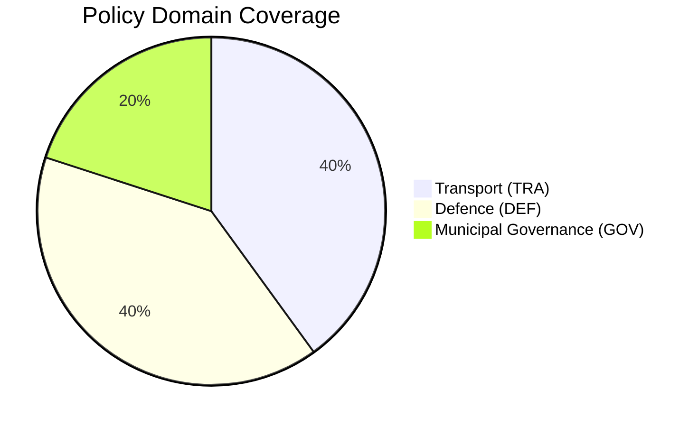

# Document Classification — 2026-03-31

**Generated**: 2026-03-31 07:42 UTC
**Documents Classified**: 2
**Riksmöte**: 2025/26

---

## Classification Summary

| dok_id | Type | Sensitivity | Domain | Urgency | Significance |
|--------|------|:-----------:|--------|:-------:|:------------:|
| HD10424 | interpellation (ip) | 🟡 SENSITIVE | Transport (TRA) + Defence (DEF) | 🟠 URGENT | 5/10 |
| HD10425 | interpellation (ip) | 🟡 SENSITIVE | Defence (DEF) + Transport (TRA) + Municipal Gov (GOV) | 🟠 URGENT | 6/10 |

Both classified as SENSITIVE due to emergency preparedness and defence infrastructure dimensions. Both URGENT — minister must respond by 2026-04-21.

---

## Domain Distribution

