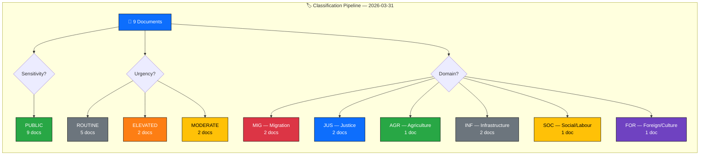

  

<h1 align="center">🏷️ Political Event Classification</h1>

  <strong>📊 Document Classification Results — 2026-03-31</strong> 
  <em>🎯 Sensitivity · Domain · Urgency · Significance</em>

**Document Owner**: CEO | **Version**: 2.0 | **Last Updated**: 2026-03-31 | **Org.nr**: 559432-2196 | **Classification**: PUBLIC

---

## 📋 Classification Context

| Field | Value |
|-------|-------|
| **Classification ID** | `CLS-2026-03-31-001` |
| **Classification Date** | `2026-03-31 06:00 UTC` |
| **Riksmöte** | 2025/26 |
| **Documents Classified** | 9 |
| **Classification Dimensions** | Sensitivity, Domain, Urgency, Significance |
| **Produced By** | Copilot Political Intelligence Agent |
| **Review Status** | Automated — human review recommended for ELEVATED items |

---

## 🏷️ Classification Decision Tree

---

## 📊 Batch Classification Results

| dok_id | Title | Type | Domain | Sensitivity | Urgency | Significance |
|--------|-------|------|--------|:-----------:|:-------:|:------------:|
| `HD03229` | En ny mottagandelag | Proposition | MIG — Migration | 🟢 PUBLIC | 🟠 ELEVATED | 7.0/10 |
| `HD03215` | Tidsbegränsat boende för vissa nyanlända invandrare | Proposition | MIG — Migration | 🟢 PUBLIC | 🟠 ELEVATED | 6.6/10 |
| `HD03222` | Ersättningsregler med brottsoffret i fokus | Proposition | JUS — Justice | 🟢 PUBLIC | 🟡 MODERATE | 5.0/10 |
| `HD03223` | En ny konsumentkreditlag | Proposition | JUS — Justice | 🟢 PUBLIC | 🟡 MODERATE | 3.8/10 |
| `HD01MJU18` | Förbättrat genomförande av UTP-direktivets förbud mot sena annulleringar | Committee Report | AGR — Agriculture/Trade | 🟢 PUBLIC | ⚪ ROUTINE | 2.8/10 |
| `HD11671` | Asbestexponering och brister i arbetsmiljöarbetet vid renoveringar | Written Question | SOC — Social/Labour | 🟢 PUBLIC | ⚪ ROUTINE | 2.6/10 |
| `HD11670` | Fransk rapport om Muslimska brödraskapet | Written Question | FOR — Foreign/Culture | 🟢 PUBLIC | ⚪ ROUTINE | 2.4/10 |
| `HD10424` | Flyglinjen Torsby/Hagfors–Arlanda | Interpellation | INF — Infrastructure | 🟢 PUBLIC | ⚪ ROUTINE | 2.2/10 |
| `HD10425` | Fördelning av ansvar för infrastrukturkostnader vid försvarsetableringar | Interpellation | INF — Infrastructure | 🟢 PUBLIC | ⚪ ROUTINE | 2.0/10 |

---

## 📊 Classification Distribution

### By Document Type
| Type | Count | Avg. Significance |
|------|:-----:|:-----------------:|
| Proposition | 4 | 5.6/10 |
| Committee Report | 1 | 2.8/10 |
| Written Question | 2 | 2.5/10 |
| Interpellation | 2 | 2.1/10 |

### By Policy Domain
| Domain | Count | dok_ids |
|--------|:-----:|---------|
| MIG — Migration | 2 | `HD03229`, `HD03215` |
| JUS — Justice | 2 | `HD03222`, `HD03223` |
| INF — Infrastructure | 2 | `HD10424`, `HD10425` |
| AGR — Agriculture/Trade | 1 | `HD01MJU18` |
| SOC — Social/Labour | 1 | `HD11671` |
| FOR — Foreign/Culture | 1 | `HD11670` |

### By Urgency
| Urgency | Count | dok_ids |
|---------|:-----:|---------|
| 🟠 ELEVATED | 2 | `HD03229`, `HD03215` |
| 🟡 MODERATE | 2 | `HD03222`, `HD03223` |
| ⚪ ROUTINE | 5 | `HD01MJU18`, `HD11671`, `HD11670`, `HD10424`, `HD10425` |

---

## 🔑 Key Classification Insights

1. **All documents are PUBLIC sensitivity** — No restricted or sensitive classifications. All source documents are publicly available via riksdagen.se.
2. **Migration is the dominant domain** — 2 of 4 propositions target migration policy, representing the highest urgency and significance cluster.
3. **Propositions consistently outrank other types** — Average significance 5.6/10 vs. 2.1-2.8/10 for interpellations, questions, and committee reports.
4. **Six distinct policy domains** — Broad legislative scope for a single day, covering migration, justice, agriculture/trade, infrastructure, social policy, and foreign affairs.
5. **No URGENT or CRITICAL urgency classifications** — All items fall within standard legislative timelines.

---

## 📎 Document Control

| Field | Value |
|-------|-------|
| **Template** | `analysis/templates/political-classification.md` |
| **Version** | 2.0 |
| **Analyst** | Copilot Political Intelligence Agent |
| **Classification** | PUBLIC |
| **Next Review** | 2026-06-30 |
| **MCP Data Sources** | riksdag-regering-mcp (9 documents, 2 interpellations) |

