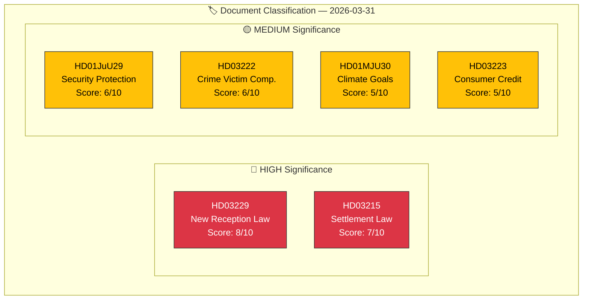

# 🏷️ Political Classification Results

## 📋 Classification Context

| Field | Value |
|-------|-------|
| **Classification ID** | `CLS-2026-03-31-001` |
| **Analysis Date** | 2026-03-31 12:00 UTC |
| **Documents Classified** | 6 |
| **Produced By** | news-realtime-monitor |

---

## 📊 Classification Dashboard

## 📋 Batch Classification Table

| dok_id | Title | Type | Domain | Sensitivity | Significance | Score |
|--------|-------|------|--------|:-----------:|:------------:|:-----:|
| HD03229 | En ny mottagandelag | prop | Migration | SENSITIVE | HIGH | 8/10 |
| HD03215 | Tidsbegränsat boende — bosättningslag | prop | Migration/Housing | SENSITIVE | HIGH | 7/10 |
| HD01JuU29 | Stärkt säkerhetsskydd fastigheter | bet | Security/Defense | RESTRICTED | MEDIUM | 6/10 |
| HD03222 | Ersättningsregler brottsoffret i fokus | prop | Criminal Justice | PUBLIC | MEDIUM | 6/10 |
| HD01MJU30 | Sveriges klimatmål 2030 | bet | Environment | SENSITIVE | MEDIUM | 5/10 |
| HD03223 | En ny konsumentkreditlag | prop | Consumer Protection | PUBLIC | MEDIUM | 5/10 |

---

## 📊 MCP Data Files Used

| Tool | Parameters | Data Retrieved |
|------|-----------|----------------|
| `get_propositioner` | rm=2025/26 | Proposition classification data |
| `get_betankanden` | rm=2025/26 | Committee report classification data |
