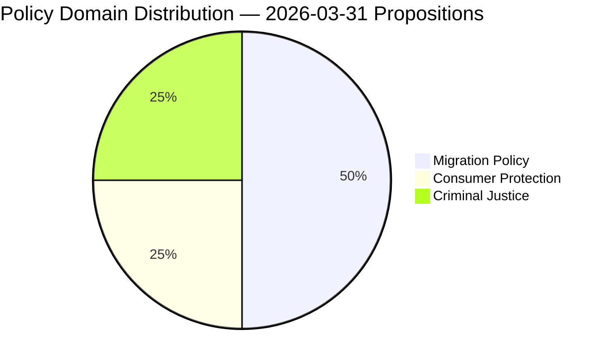

# Political Classification Results — 2026-03-31

**Generated**: 2026-04-01 05:43 UTC  
**Data Sources**: riksdag-regering-mcp get_propositioner, get_dokument_innehall  
**Documents Analyzed**: 4  
**Confidence**: MEDIUM

## Summary

Classified 4 government propositions by sensitivity, policy domain, urgency, and significance. Three from Justitiedepartementet (justice reform cluster) and one from Arbetsmarknadsdepartementet (migration/integration). Primary domains: migration policy, consumer protection, criminal justice.

## Classification Results

| dok_id | Title | Type | Ministry | Committee | Domain | Significance | Sensitivity |
|--------|-------|------|----------|-----------|--------|:------------:|:-----------:|
| HD03229 | En ny mottagandelag | prop | Justitiedepartementet | SfU | Migration Policy | 6/10 | PUBLIC |
| HD03215 | Tidsbegränsat boende för nyanlända | prop | Arbetsmarknadsdepartementet | AU | Migration/Integration | 6/10 | PUBLIC |
| HD03223 | En ny konsumentkreditlag | prop | Justitiedepartementet | CU | Consumer Protection | 4/10 | PUBLIC |
| HD03222 | Ersättningsregler med brottsoffret i fokus | prop | Justitiedepartementet | CU | Criminal Justice/Victims | 4/10 | PUBLIC |

## Domain Distribution

## Key Findings

1. **Migration policy cluster**: HD03229 (new reception law) and HD03215 (settlement law) form a coordinated migration reform package — highest significance (6/10)
2. **Justice reform dominance**: 3 of 4 propositions from Justitiedepartementet reflects coalition's law-and-order agenda
3. **Committee spread**: Propositions distributed across SfU, CU, AU — indicates cross-cutting legislative ambition
4. **All PUBLIC sensitivity**: No classified or restricted content; standard legislative transparency

## Data Quality Notes

Classification confidence: MEDIUM. Domain assignment based on committee referral (SfU=migration, CU=civil/consumer, AU=labour/integration) and title/summary analysis.
