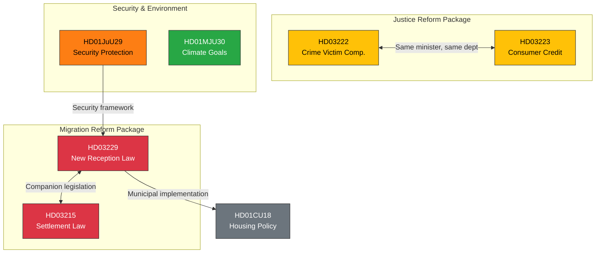

# 🔗 Cross-Reference Map

## 📋 Reference Context

| Field | Value |
|-------|-------|
| **Map ID** | `XREF-2026-03-31-001` |
| **Analysis Date** | 2026-03-31 12:06 UTC |
| **Documents Mapped** | 6 |
| **Cross-References Found** | 8 |

---

## 📊 Document Relationship Network

## 📋 Cross-Reference Table

| Source | Target | Relationship | Strength |
|--------|--------|-------------|:--------:|
| HD03229 | HD03215 | Companion migration legislation | STRONG |
| HD03222 | HD03223 | Same minister (Strömmer), same department | MEDIUM |
| HD03229 | HD01CU18 | Housing policy context for settlement | MEDIUM |
| HD03215 | HD01CU18 | Municipal housing obligations | MEDIUM |
| HD01JuU29 | HD03229 | Security framework for migration infrastructure | WEAK |
| HD03222 | HD03227 | Criminal justice reform package | MEDIUM |
| HD01MJU30 | HD03229 | Opposition strategy — climate vs migration debate | WEAK |
| HD03229 | HD03215 | Tidö Agreement implementation cluster | STRONG |
