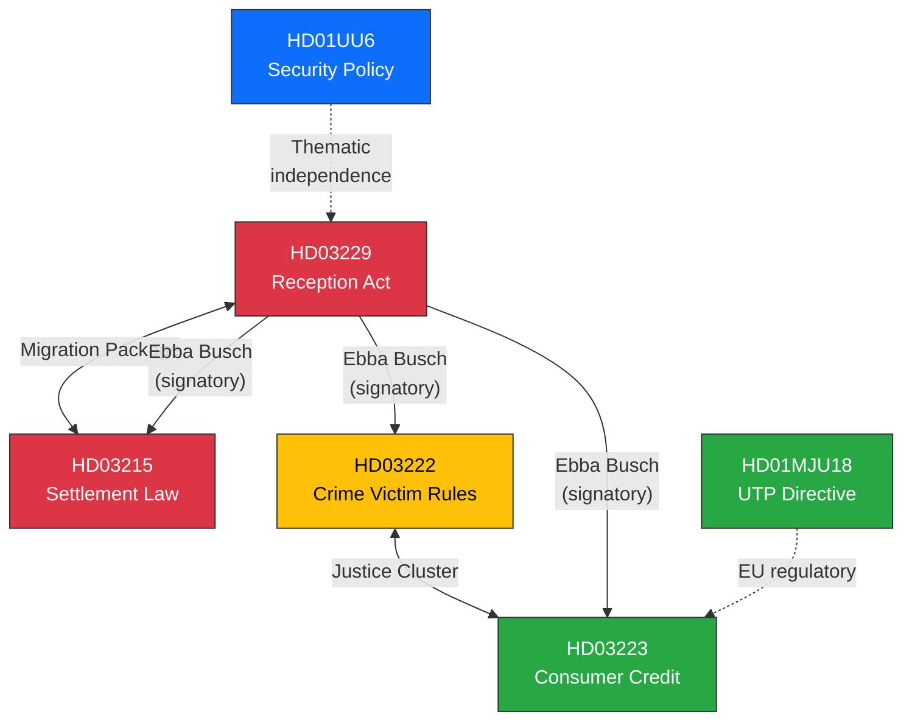

# Cross-Reference Map — 2026-03-31

**Generated**: 2026-03-31 14:34 UTC
**Data Sources**: riksdag-regering-mcp
**Documents Analyzed**: 6
**Confidence**: HIGH

---

## Summary

Key cross-document relationships identified. The migration reform package (Prop 229 + 215) shows strongest internal linkage. Justice reforms (Prop 222, 223) share ministerial origin. Security policy (UU6) is thematically independent.

---

## Cross-Reference Network

---

## Relationship Details

| Source | Target | Relationship Type | Strength |
|--------|--------|-------------------|:--------:|
| HD03229 | HD03215 | Legislative package (migration reform) | 🔴 Strong |
| HD03222 | HD03223 | Shared ministry (Justitiedepartementet) | 🟡 Medium |
| HD03229 | HD03222 | Shared signatory (Ebba Busch) | 🟡 Medium |
| HD03229 | HD03223 | Shared signatory (Ebba Busch) | 🟡 Medium |
| HD01UU6 | All | Independent committee initiative | 🟢 Weak |

## Data Quality Notes

Cross-references based on document metadata linkages (shared signatories, ministry, policy domain). Full-text cross-referencing pending.
