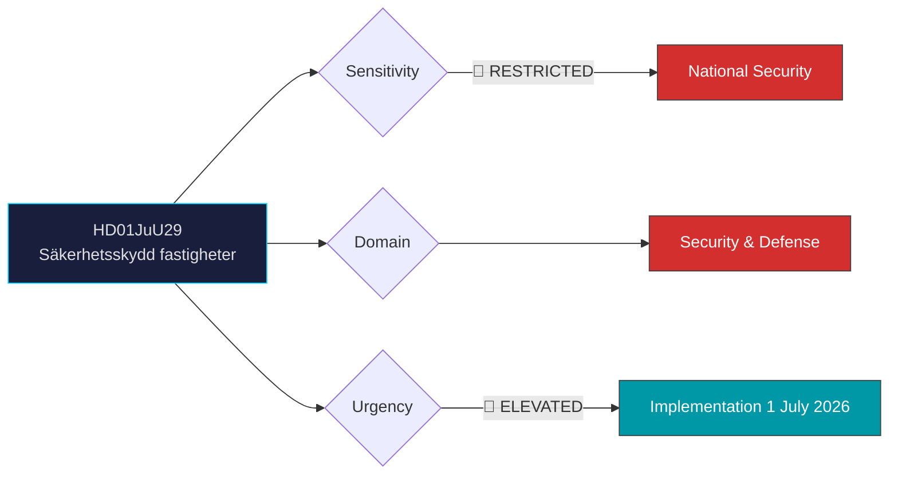

# 🔍 Per-File Political Intelligence Analysis: HD01JuU29

## 📋 Document Identity

| Field | Value |
|-------|-------|
| **Document ID** | `HD01JuU29` |
| **Document Type** | `committeeReports` |
| **Title** | Stärkt säkerhetsskydd vid överlåtelse av fast egendom |
| **Date** | 2026-03-26 |
| **Riksmöte** | 2025/26 |
| **Source MCP Tool** | `get_betankanden` |
| **Analysis Timestamp** | 2026-03-31 11:50 UTC |
| **Analyst** | news-realtime-monitor |

---

## 🎯 Executive Summary

JuU betänkande 2025/26:JuU29 approves the government's proposal to extend security protection law to cover property transfers. This is a national security measure requiring security assessments before transferring properties significant to Sweden's security, with the supervisory authority empowered to prohibit unsuitable transfers. The law directly targets hostile foreign acquisition of security-sensitive real estate — a growing concern in the Nordic security landscape post-NATO accession. Effective 1 July 2026, this represents bipartisan security consensus. **Confidence: HIGH**

---

## 📊 Political Classification

---

## 💼 SWOT Analysis

### ✅ Strengths

| # | Statement | Evidence (dok_id) | Confidence | Impact | Entry Date |
|---|-----------|-------------------|:----------:|:------:|:----------:|
| S1 | Cross-party support expected — national security measures enjoy broad consensus | HD01JuU29 | H | H | 2026-03-31 |
| S2 | Fills critical gap in security protection framework for physical assets | HD01JuU29 | H | H | 2026-03-31 |
| S3 | Aligns with NATO membership obligations on critical infrastructure protection | HD01JuU29 | M | H | 2026-03-31 |

### ⚠️ Weaknesses

| # | Statement | Evidence (dok_id) | Confidence | Impact | Entry Date |
|---|-----------|-------------------|:----------:|:------:|:----------:|
| W1 | Property market uncertainty during transition period | HD01JuU29 | M | M | 2026-03-31 |
| W2 | Administrative burden on property transfers near sensitive sites | HD01JuU29 | M | L | 2026-03-31 |

### 🌟 Opportunities

| # | Statement | Evidence (dok_id) | Confidence | Impact | Entry Date |
|---|-----------|-------------------|:----------:|:------:|:----------:|
| O1 | Strengthens Sweden's position in Nordic security cooperation | HD01JuU29 | M | H | 2026-03-31 |

### 🔴 Threats

| # | Statement | Evidence (dok_id) | Confidence | Impact | Entry Date |
|---|-----------|-------------------|:----------:|:------:|:----------:|
| T1 | Foreign state actors may seek circumvention through corporate structures | HD01JuU29 | M | H | 2026-03-31 |

---

## 👥 Stakeholder Impact

| Stakeholder | Impact | Assessment |
|-------------|:------:|------------|
| **National security agencies** | HIGH | New enforcement powers and responsibilities |
| **Property market** | MEDIUM | Additional compliance layer for sensitive area transactions |
| **Government** | HIGH | Demonstrates security commitment post-NATO accession |
| **Foreign investors** | MEDIUM | Due diligence requirements increase for Swedish property |

---

## 📊 MCP Data Files Used

| Tool | Parameters | Data Retrieved |
|------|-----------|----------------|
| `get_betankanden` | rm=2025/26 | HD01JuU29 metadata and summary |
| `get_dokument` | dok_id=HD01JuU29 | Committee report details |
